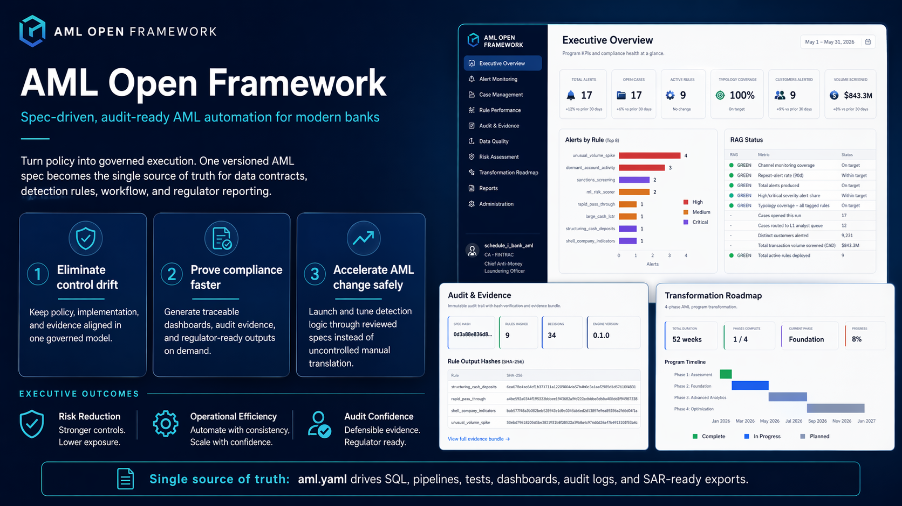

# AML Open Framework

**An anti-money-laundering program you can show to your regulator without a six-week reconstruction.**

The hard part of AML at a bank is not detection. It's proving — months later — that the right rule fired, was reviewed, was acted on, and that nothing was quietly turned off. *(See [PAIN-1, PAIN-2 in the leader pain doc](https://github.com/tomqwu/aml_open_framework/blob/main/docs/research/2026-04-aml-process-pain.md) — across recent enforcement orders, regulators rarely allege missed typologies; they allege the bank cannot evidence what it did.)*

This framework gives the AML org one source of truth that compliance can read, engineering can ship, and an auditor can replay byte-for-byte. The day-to-day result: analysts stop hunting across eight tabs, supervisors see real status not Excel rumours, and when the regulator walks in, the examination ZIP is already on the shelf.



## What changes for each role

| If you are a… | What changes |
|---|---|
| **CCO / Head of FCC** | Board reports compute themselves from the live program — no more 18-month-stale risk assessment in a binder |
| **MLRO / 2LoD** | You read the same artifact 1LoD ships. "Is this rule still earning its keep?" is one command, not a six-week vendor study |
| **Analyst** | Each alert opens with the transaction list, KYC, sanctions hit, network neighbours, and prior STRs already attached |
| **Auditor** | Replay any historical run; verify the hash chain; pull the FINTRAC / OSFI / FinCEN exam pack in 60 seconds |
| **CRO / CFO** | Apache 2.0 — runs in your perimeter, no per-seat licence. Effectiveness pack quantifies what the spend bought |

A live multi-audience pitch deck walking the framework slide by slide is at [`docs/pitch/deck/index.html`](https://github.com/tomqwu/aml_open_framework/blob/docs/pitch-deck/docs/pitch/deck/index.html) — start there if you have 5 minutes.

---

## Quickstart

```bash
git clone https://github.com/tomqwu/aml_open_framework.git && cd aml_open_framework
pip install -e ".[dev,dashboard,api]"
aml demo --persona cco        # 5-min guided tour for a non-technical buyer
# or:
aml dashboard examples/community_bank/aml.yaml
# Open http://localhost:8501
```

`aml demo` runs validate → engine → audit pack against the canonical Canadian Schedule-I bank spec, narrates each step, and prints persona-specific next-step commands (`--persona cco|mlro|analyst|auditor`). It exists so a CCO who has 5 minutes between meetings can self-serve a real regulator-ready audit pack — no vendor demo cycle required.

**5-minute path with no prior context:** [`docs/getting-started.md`](docs/getting-started.md) — install, pick a spec, run, launch dashboard, bring your own data, write your first detector, generate an audit bundle.

---

## Documentation Map

### Start here

| Doc | Use when |
|---|---|
| 📖 [Getting Started](docs/getting-started.md) | First install through your first audit bundle (15 min) |
| 👥 [Personas & Workflows](docs/personas.md) | Map your role (CCO / MLRO / Analyst / Auditor / Developer) to the framework |
| 📊 [Dashboard Tour](docs/dashboard-tour.md) | All 26 pages with screenshots + audience filtering |
| 🤔 [10 Daily Pain Points](https://github.com/tomqwu/aml_open_framework/blob/main/docs/research/2026-04-aml-process-pain.md) | The real reasons AML leaders feel stuck — primary-source quotes only |

### How it works

| Doc | Covers |
|---|---|
| 🏛 [Architecture](docs/architecture.md) | End-to-end data flow + design rationale |
| 📜 [Spec Reference](docs/spec-reference.md) | Every field in `aml.yaml` — for engineers |
| 🌍 [Multi-Jurisdiction](docs/jurisdictions.md) | US (FinCEN), CA (FINTRAC/OSFI), EU (EBA/AMLD6), UK (FCA/POCA) example specs + how to adapt |
| 🔌 [REST API](docs/api-reference.md) | FastAPI endpoint catalogue with JWT auth + multi-tenant isolation |
| 📈 [Metrics Framework](docs/metrics-framework.md) | Metric types, RAG thresholds, audience routing, report rendering |
| 🔍 [Audit & Evidence](docs/audit-evidence.md) | Evidence-bundle specification + SHA-256 hash-chain verification |
| ⚖️ [Regulator Mapping](docs/regulator-mapping.md) | FinCEN / FINTRAC / OFAC / AMLD6 coverage matrix |

### Operations

| Doc | Covers |
|---|---|
| 🚀 [Deployment](docs/deployment.md) | Docker Compose + Helm charts for Kubernetes |
| 📚 [Case Studies](docs/case-studies/) | Real enforcement walkthroughs (TD 2024 etc.) |
| 🤝 [Contributing](CONTRIBUTING.md) | Setup, PR process, project rules |
| 📋 [Changelog](CHANGELOG.md) | Round-by-round PR-level history |
| 📊 [Progress Snapshot](docs/progress.md) | Fact-based audit of what's shipped (modules, tests, regulatory coverage) |
| 🔍 [Competitive Positioning Research](docs/research/2026-04-competitive-positioning.md) | Where this framework slots vs. Actimize / Hawk / Marble / Jube |

---

## Key CLI Commands

```bash
aml dashboard spec.yaml                              # launch web UI (start here)
aml validate spec.yaml                               # check the spec is internally consistent
aml run spec.yaml [--data-source csv --data-dir ./]  # execute detectors on data
aml audit-pack spec.yaml --jurisdiction CA-FINTRAC   # build the regulator examination ZIP
aml backtest spec.yaml --rule X --quarters 4         # is rule X still earning its keep?
aml replay spec.yaml run-dir/                        # prove a historical run replays byte-for-byte
aml api --port 8000                                  # launch REST API
```

Full catalogue: [`docs/getting-started.md#cli-commands`](docs/getting-started.md). Data sources: `synthetic` (default), `csv`, `parquet`, `duckdb`, `iso20022`, `s3`, `gcs`, `snowflake`, `bigquery`.

---

## How it works under the hood

The framework's mechanics — for engineers and 2LoD model-validation teams — sit below the leader-facing surface:

- **One YAML spec** declares data contracts, detection rules, case workflow, metrics, and reporting forms. Every artifact (SQL, dashboards, audit logs, SAR exports) is generated from it and traceable back to a regulation citation.
- **JSON Schema + Pydantic two-layer validation** catches structural and cross-reference errors before the engine starts.
- **DuckDB in-memory engine** runs detectors deterministically — same spec + same data + same seed = identical output hashes (covered by `test_run_is_reproducible`).
- **SHA-256 hash-chained `decisions.jsonl`** makes the audit ledger tamper-evident.
- **FastAPI** REST layer with JWT/OIDC auth + multi-tenant isolation for institutions that want API access alongside the dashboard.

```
schema/aml-spec.schema.json     JSON Schema for aml.yaml (the contract)
examples/                       9 example specs across 5 jurisdictions
src/aml_framework/
  spec/                         Parse + validate the spec
  generators/                   Emit SQL, DAG stubs, audit packs, STR narratives, MRM dossiers
  engine/                       Execute detectors, audit ledger, tuning lab, backtester
  metrics/                      Metric evaluation + report rendering
  cases/                        Investigation aggregator, SLA timer, STR bundling, fraud↔AML linkage
  data/                         Synthetic generator + ISO 20022 ingestion
  dashboard/                    Streamlit web dashboard (26 pages, persona-aware)
  compliance/                   Regulation-drift watcher, BOI workflow, cross-border sandbox
  integrations/                 Travel-Rule webhook adapters (Notabene, Sumsub)
  api/                          FastAPI REST layer + FINOS Open Compliance API draft
  cli.py                        `aml` command-line entry point
deploy/helm/                    Helm chart for Kubernetes
docs/                           Architecture, persona, spec, API, deployment guides
tests/                          1,180+ tests across unit, API, e2e
```

---

## Testing

```bash
pytest tests/ --ignore=tests/test_e2e_dashboard.py -q   # unit + API (~2 min)
pytest tests/test_e2e_dashboard.py                       # Playwright e2e (~2 min)
pytest tests/                                            # everything
```

CI runs 5 jobs on every PR: `lint`, `unit-tests`, `api-tests`, `e2e-dashboard`, `docker-build`. See [`CONTRIBUTING.md`](CONTRIBUTING.md) for the pre-commit checklist.

---

## Status

Reference implementation — not a certified compliance product. Use it to prototype controls, drive internal conversations, or anchor a spec-first migration of an existing AML program. Any production deployment needs institution-specific tuning, model validation, and sign-off from your second line of defense.

## License

Apache-2.0.
