# AML Open Framework

Spec-driven, audit-ready Anti-Money Laundering automation for banks and other
regulated financial institutions. One versioned `aml.yaml` spec is the single
source of truth for data contracts, detection rules, case workflow, and
regulator reporting — every artifact (SQL, pipelines, dashboards, audit logs,
SAR exports) is generated from it and traceable back to a regulation citation.


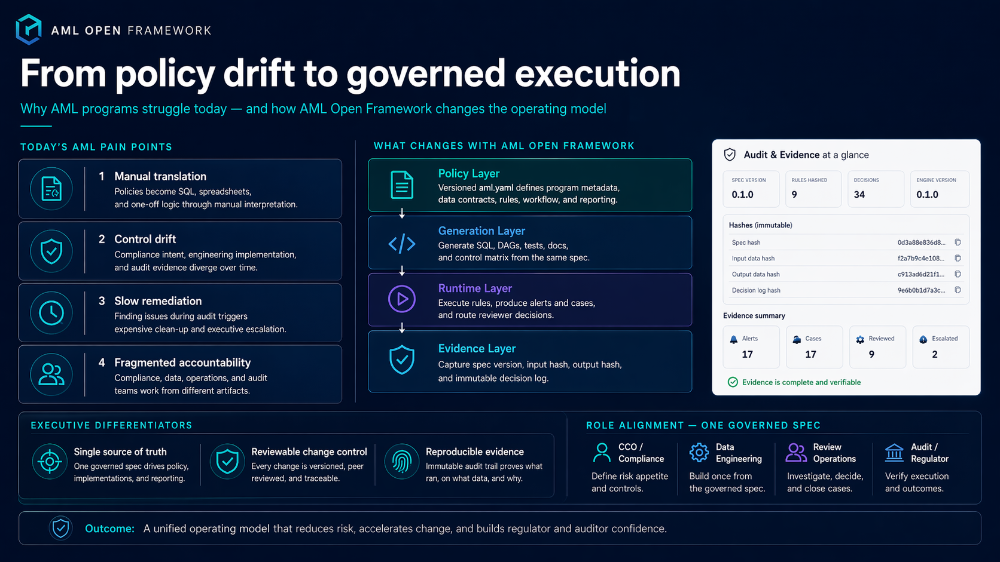

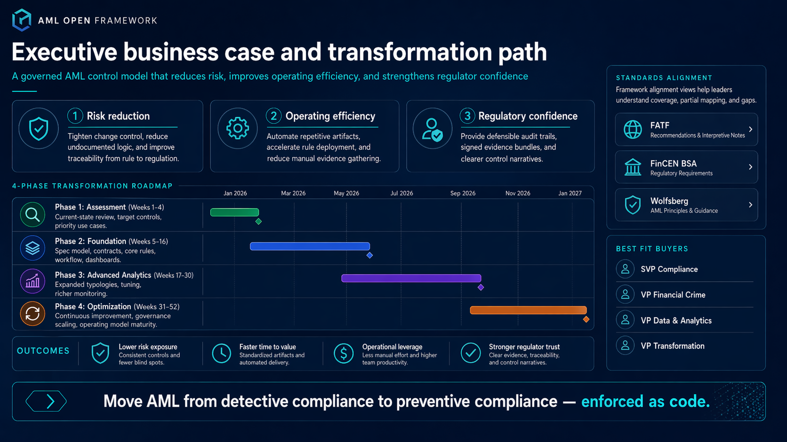

## Why

Banks lose years of compliance work to drift between **policy** (what the
regulator expects), **implementation** (what the pipelines actually do), and
**evidence** (what the auditor can prove). The usual result is six-figure
fines, remediation programs, and burned-out compliance teams.

This framework attacks the drift directly:

- **Business owner / Chief Compliance Officer** writes policy in a reviewable
  YAML spec, with every rule annotated to a regulation clause.
- **Data engineer** gets generated DAGs, SQL, and data-quality tests from the
  same spec — no hand-translation from PDF policy docs.
- **Data team** sees lineage and freshness SLAs enforced as code.
- **Auditor** gets a reproducible evidence bundle: spec version + input hash +
  rule output + reviewer decisions, signed and immutable.
- **Regulator** gets a control narrative and SAR-ready exports on demand.

See [`docs/architecture.md`](docs/architecture.md) for the reference design and
[`docs/personas.md`](docs/personas.md) for how each role interacts with the
framework.

## Architecture

### End-to-end data flow

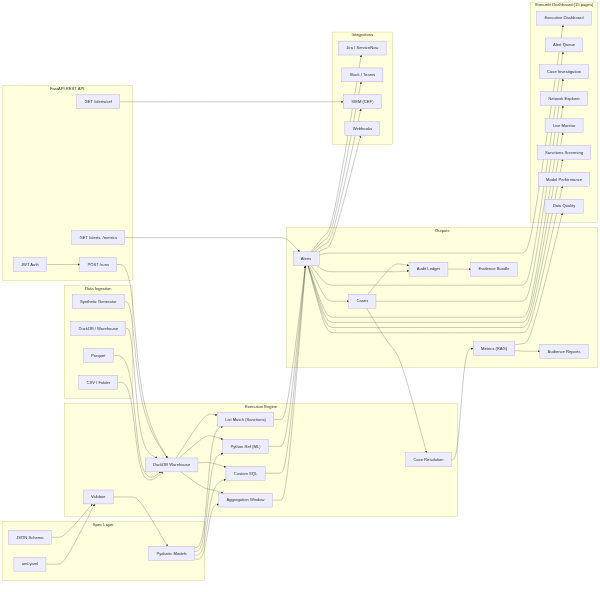

### Case lifecycle

Transactions flow through 4 rule types, generate alerts, open cases with SLA-tracked
queues, and produce an immutable audit trail with SHA-256 hash verification.

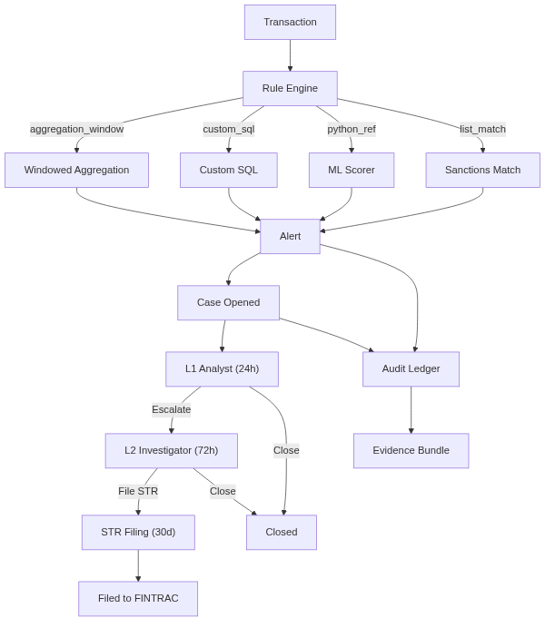

## Quickstart

```bash
# Install
make install                  # or: pip install -e ".[dev,dashboard,api]"

# Validate a spec
make validate                 # checks all 3 example specs

# Run with sample CSV data (included in data/input/)
make run                      # or: aml run examples/canadian_schedule_i_bank/aml.yaml --data-source csv --data-dir data/input/

# Run with synthetic data (no files needed)
make run-synthetic            # or: aml run examples/canadian_schedule_i_bank/aml.yaml --seed 42

# Launch the interactive dashboard
make dashboard                # opens at http://localhost:8501

# Run tests
make test                     # unit + API tests (fast, ~10s)
make test-all                 # includes Playwright browser tests

# View all available commands
make help
```

### Bring your own data

Drop CSV files into `data/input/` matching the data contract schema:

```
data/input/
  txn.csv          # txn_id, customer_id, amount, currency, channel, direction, booked_at
  customer.csv     # customer_id, full_name, country, risk_rating, onboarded_at
```

Then run:
```bash
aml run examples/canadian_schedule_i_bank/aml.yaml --data-source csv --data-dir data/input/
```

Sample CSV files with 438 transactions and 25 customers are included for
immediate testing.

### CLI commands

```bash
aml validate spec.yaml                              # validate spec
aml generate spec.yaml                               # emit SQL, DAG stubs, control matrix
aml run spec.yaml [--data-source csv --data-dir ./]  # execute rules
aml report spec.yaml --audience svp --stdout         # print role report
aml export spec.yaml --out evidence.zip              # evidence bundle
aml export-alerts spec.yaml --out alerts.csv         # alert CSV export
aml diff spec_a.yaml spec_b.yaml                     # compare two specs
aml replay spec.yaml run-dir/                         # verify determinism
aml schedule spec.yaml --interval 1h                  # run on a schedule
aml dashboard spec.yaml                               # launch web UI
aml api --port 8000                                   # launch REST API
```

Data sources: `--data-source synthetic` (default), `csv`, `parquet`, `duckdb`, `s3`, `gcs`, `snowflake`, `bigquery`.

### REST API

```bash
aml api --port 8000
# Interactive docs: http://localhost:8000/docs (Swagger UI)
```

```bash
# Login (demo users: admin, analyst, auditor, manager)
TOKEN=$(curl -s -X POST http://localhost:8000/api/v1/login \
  -H "Content-Type: application/json" \
  -d '{"username":"admin","password":"admin"}' | jq -r .access_token)

# Create a run
curl -X POST http://localhost:8000/api/v1/runs \
  -H "Authorization: Bearer $TOKEN" \
  -H "Content-Type: application/json" \
  -d '{"spec_path":"examples/canadian_schedule_i_bank/aml.yaml","seed":42}'

# List runs
curl -H "Authorization: Bearer $TOKEN" http://localhost:8000/api/v1/runs

# Validate a spec
curl -X POST http://localhost:8000/api/v1/validate \
  -H "Authorization: Bearer $TOKEN" \
  -H "Content-Type: application/json" \
  -d '{"spec_path":"examples/eu_bank/aml.yaml"}'
```

Rate limiting: 600 requests/minute per IP (configurable via `API_RATE_LIMIT` env var).

## Interactive Dashboard

The framework includes a Streamlit web dashboard for interactive demos and
stakeholder presentations. It runs the full engine on startup and presents
results across 20 purpose-built pages.

```bash
pip install -e ".[dev,dashboard]"
aml dashboard examples/community_bank/aml.yaml
# Opens at http://localhost:8501
```

### Executive Dashboard

Program-level KPIs, alert-by-rule breakdown with severity coloring, RAG status
grid for all metrics, and a program health radar chart. Audience filtering in
the sidebar lets you switch between SVP, VP, Director, Manager, PM, Developer,
and Business views.


### Program Maturity Assessment

12-dimension maturity spider chart based on Big-4 consulting firm methodologies
(Deloitte, EY, PwC, KPMG). Current scores are derived from spec coverage
(number of active rules, workflow queues, data quality checks). Target scores
show where the program needs to be. Expandable dimension cards provide
assessment rationale and recommendations.


### Alert Queue

Filterable, sortable alert triage view for L1 analysts. Filter by rule or
severity, view aggregated amounts and time windows, and drill into individual
alerts. Charts show alert volume by rule and severity distribution.


### Case Investigation

Full investigation workspace with entity profile (customer details, risk
rating, country), alert details (regulation citations, evidence requested),
transaction timeline with alert window highlighting, Sankey flow diagram
showing channel-level fund movement, and evidence panel.


### Rule Performance

Per-rule analytics table showing alert counts, detection rates, and logic
types. Severity distribution charts, detection coverage by logic type, and a
rule-to-regulation cross-reference matrix. Typology tag coverage shows which
declared typologies have active detection.


### Risk Assessment

Customer risk distribution (low/medium/high), geographic exposure by country,
transaction volume heatmap (risk rating x channel), and a table of all alerted
customers with their profiles.


### Audit & Evidence

Full run manifest with JSON viewer, SHA-256 hash verification for every rule
output, append-only decision log, evidence bundle file tree with byte sizes,
and the spec snapshot captured at execution time. This is the auditor and
regulator view.


### Framework Alignment

Three-tab mapping of spec primitives to international regulatory standards:
- **FATF 40 Recommendations** — 10 key recommendations mapped with coverage status
- **FinCEN BSA 6 Pillars** — including the April 2026 proposed 6th pillar (formalized risk assessment)
- **AMLD6 Requirements** — 7 EU articles mapped (Art.8 Risk Assessment through Art.50 STR)
- **Wolfsberg Principles** — 8 principles with gap identification

Each mapping shows fully mapped, partially mapped, and gap status with explanatory notes.
Tabs auto-switch based on jurisdiction (US → FinCEN BSA, CA → PCMLTFA/OSFI, EU → AMLD6).

### Run History

Past engine executions from the persistence layer (SQLite locally,
PostgreSQL in production). Shows current session metadata, stored runs
with spec hashes, and run manifest for audit traceability.


### Rule Tuning

Interactive threshold what-if analysis. Select an aggregation_window rule,
adjust thresholds with sliders, and see the alert count change in real time.
Sensitivity analysis chart shows threshold vs alert volume trade-off.
Does not modify the spec — shows impact for review before YAML edit.


### Customer 360

Complete single-customer view: profile card with risk rating, transaction
history chart + table, alerts triggered, open cases, and channel breakdown.
Used by analysts for investigation prep.


### Transformation Roadmap

4-phase Gantt chart following Big-4 AML program transformation patterns:
Assessment (Weeks 1-4), Foundation (Weeks 5-16), Advanced Analytics
(Weeks 17-30), and Optimization (Weeks 31-52). Each phase includes milestones,
deliverables, and status tracking.


### Network Explorer

Interactive entity relationship graph built with networkx and streamlit-agraph.
Edges represent **temporal correlation** (outflow from one customer followed by
inflow to another within 1 hour) — this is how pass-through and layering
patterns surface. Fan-in detection counts distinct correlated counterparties.


### Live Monitor

Real-time transaction monitoring simulation with **spec-derived alert
conditions**. Screening rules are extracted from the spec's aggregation_window
filters and having thresholds. An expandable panel shows which rules drive
the screening.


### Sanctions Screening

Executes `list_match` rules against reference sanctions lists (SEMA, OFAC SDN)
with exact or fuzzy (token-overlap) matching. Shows match results with
confidence scores, matched customer profiles, and the screening rules from
the spec.


### Model Performance

ML model analytics for `python_ref` rules: model inventory with version
tracking, score distribution histograms with threshold markers, per-alert
details, and model risk management metadata (model_id, version, callable,
regulation citations).


### Data Quality

Executes data contract quality checks (`not_null`, `unique` constraints)
against actual data. Shows PASS/FAIL per check, freshness SLA compliance
with breach detection, and column-level statistics (non-null count, unique
values, types).


### Typology Catalogue

Pre-built library of 20+ AML detection rule templates across 9 categories:
structuring, layering, shell companies, sanctions/PEP, behavioral anomalies,
trade-based ML, mule activity, crypto/virtual assets, and geographic risk.
Browse templates and add to your spec with institution-specific thresholds.


### Comparative Analytics

Run-over-run comparison showing metrics vs targets, RAG distribution,
and per-rule alert counts. With stored run history, shows trends over time.


### Spec Editor & Rule Builder

Edit the AML spec YAML in-browser with live validation. The interactive
**Rule Builder** generates YAML snippets for all 4 rule types (aggregation_window,
custom_sql, list_match, python_ref) — configure fields, thresholds, and
escalation targets through a form UI.


### My Queue (Analyst Dashboard)

Personal analyst dashboard showing assigned cases, open/resolved counts,
SLA compliance percentage, and resolution time distribution. Select your
queue to see cases by severity, recent activity log, and workload charts.


### Board PDF Export

Generate a board-ready PDF report from the Executive Dashboard with program
overview, key metrics (RAG-colored), case summary, and maturity assessment.
Uses reportlab for professional formatting.

## User Workflows by Persona

The same dashboard serves 6 distinct personas, each with a different workflow
through the pages. The sidebar audience selector filters metrics to show only
what each role needs.

### CCO / SVP Workflow

The Chief Compliance Officer starts with the **Executive Dashboard** for
program-level KPIs, reviews **Program Maturity** to assess gaps across 12
dimensions, checks **Framework Alignment** for regulatory coverage (PCMLTFA
pillars, OSFI B-8), and tracks the **Transformation Roadmap** quarterly.

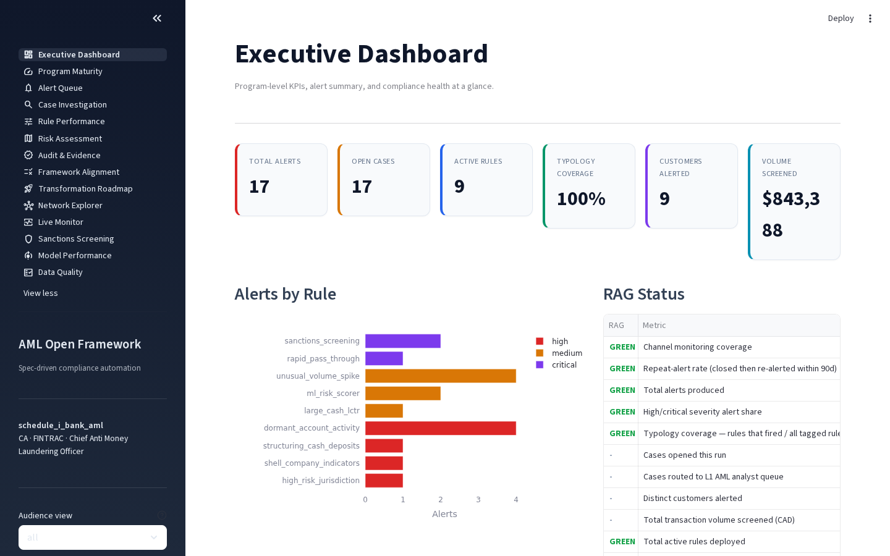

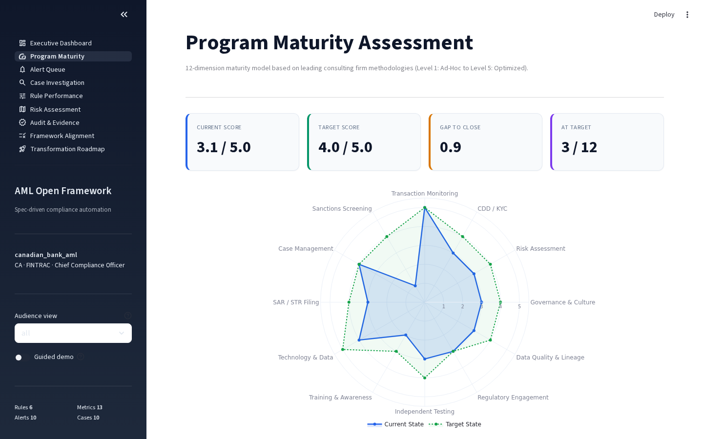

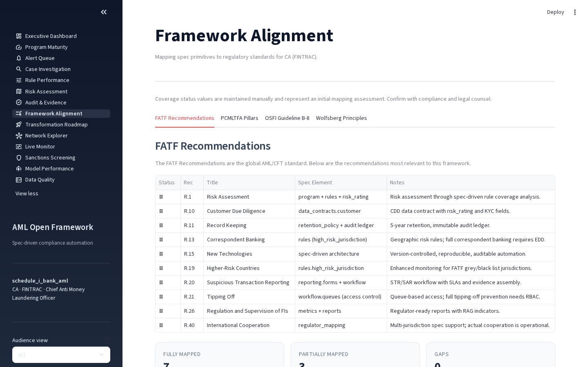

### Operations Manager Workflow

The Operations Manager monitors the **Alert Queue** daily to manage L1 analyst
workload, tracks SLA compliance and case resolution times, and reviews **Risk
Assessment** heatmaps to understand where exposure concentrates.

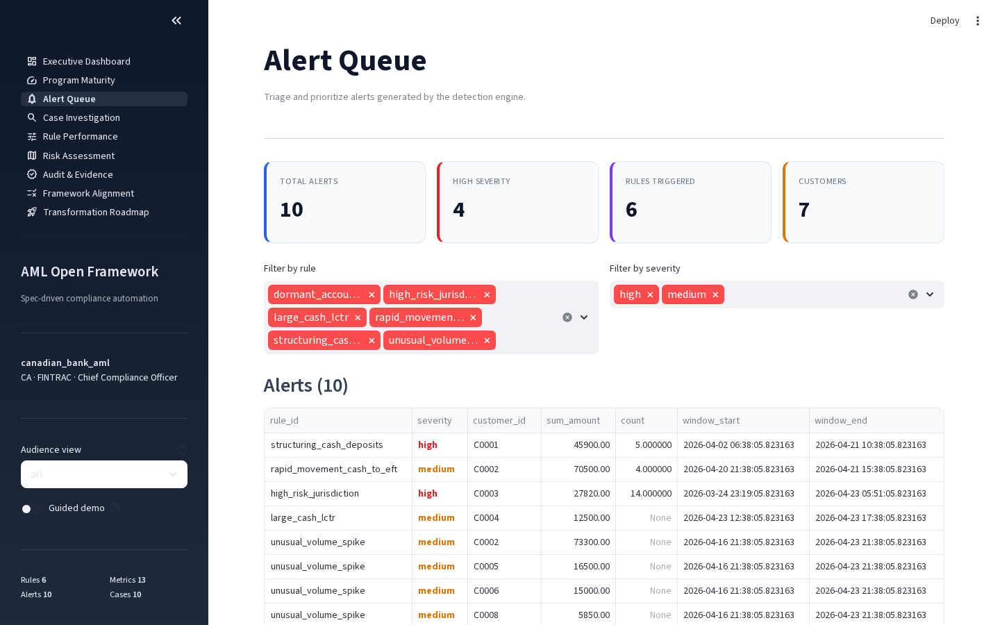

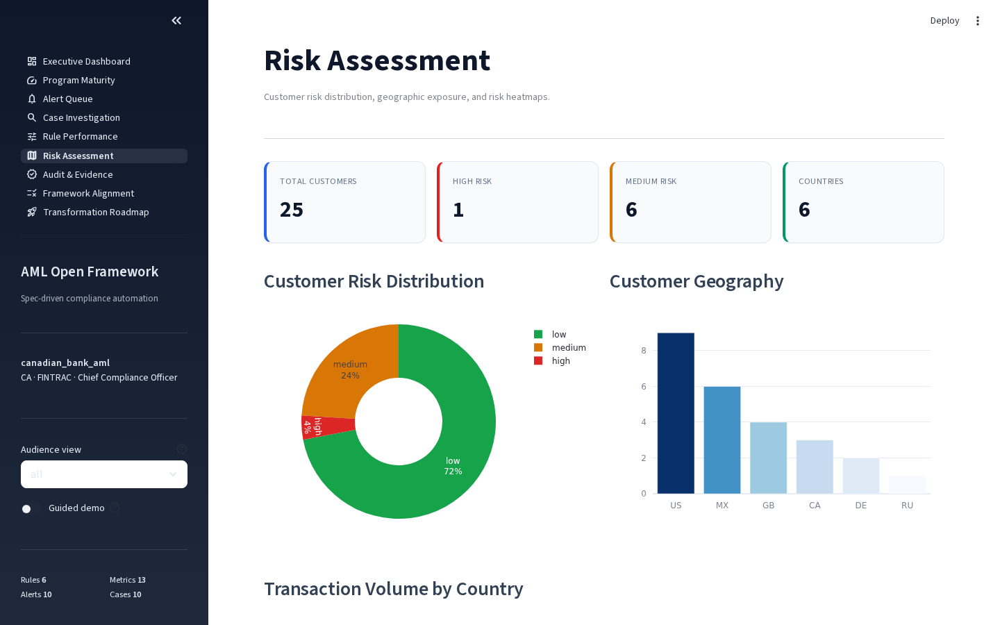

### L1 Analyst / Investigator Workflow

Analysts start at the **Alert Queue** to pick up cases by priority, then drill
into **Case Investigation** for entity profiles, transaction timelines with
highlighted alert windows, Sankey flow diagrams, regulation citations, and
evidence collection.


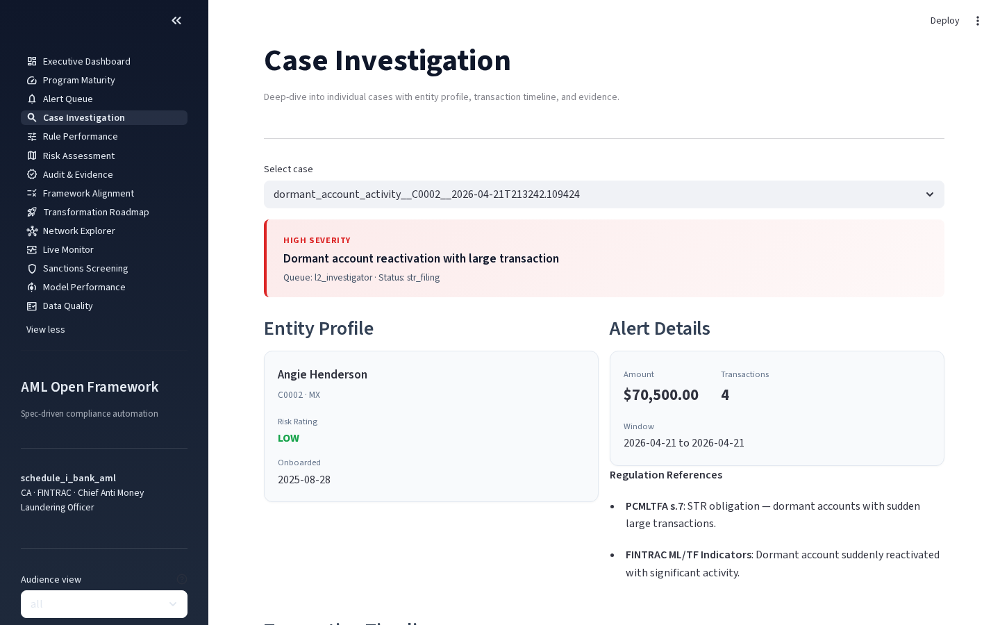

### Auditor / Regulator Workflow

Auditors go directly to **Audit & Evidence** for the immutable audit trail,
then **Data Quality** to verify contract compliance and freshness SLAs, and
**Framework Alignment** for regulatory coverage status.

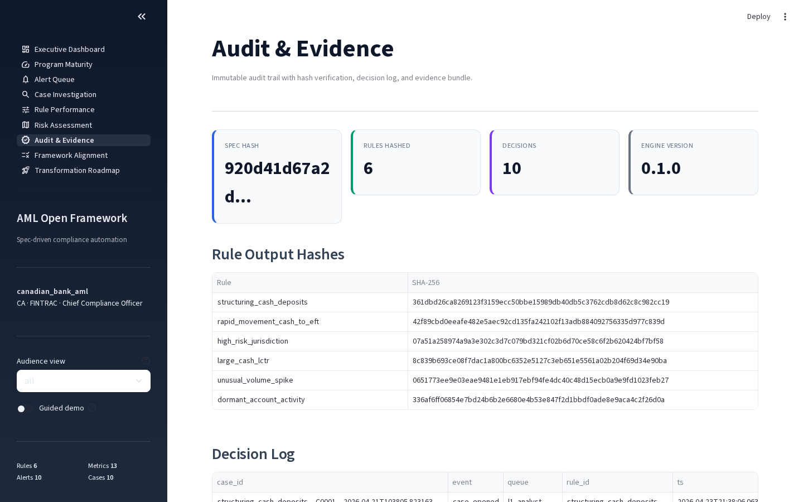

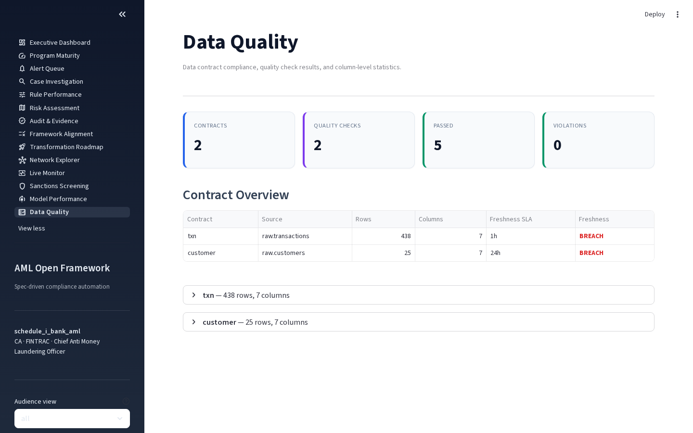

### Developer Workflow

Platform engineers monitor **Rule Performance** for per-rule analytics and
**Model Performance** for ML model scoring distributions, version tracking,
and model risk management metadata.

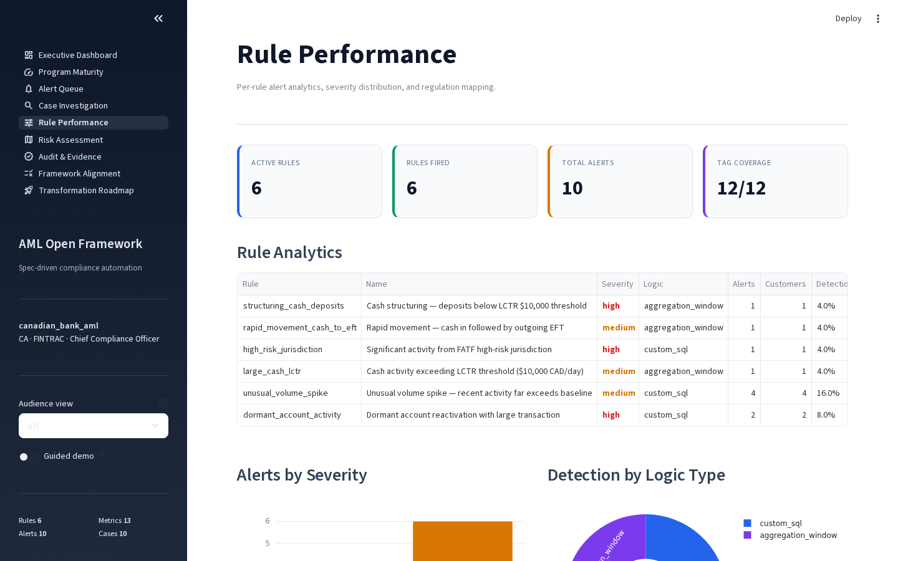

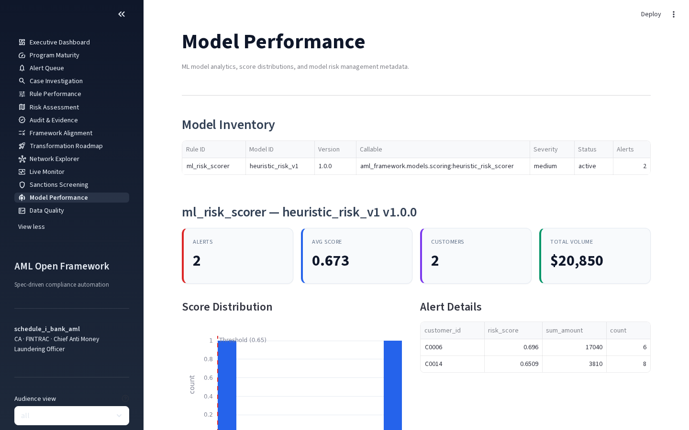

## Multi-Jurisdiction Support

The framework supports **geo-based default policies** — the same architecture
adapts to different regulatory regimes based on the `jurisdiction` field in the
spec. Five example specs are included across 4 jurisdictions:

| Spec | Jurisdiction | Regulator | Filing Types |
|------|-------------|-----------|-------------|
| `examples/community_bank/aml.yaml` | US | FinCEN | SAR, CTR |
| `examples/canadian_bank/aml.yaml` | CA | FINTRAC | STR, LCTR, EFTR |
| `examples/canadian_schedule_i_bank/aml.yaml` | CA | FINTRAC/OSFI | STR, LCTR (TD case study) |
| `examples/eu_bank/aml.yaml` | EU | EBA | EU STR (AMLD6) |
| `examples/uk_bank/aml.yaml` | UK | FCA | UK SAR (POCA 2002) |

### Canadian Regulatory Support

The Canadian spec is aligned with:
- **PCMLTFA** (Proceeds of Crime Money Laundering and Terrorist Financing Act)
  and **PCMLTFR** (Regulations) — all rule citations reference specific sections
  (e.g., `PCMLTFA s.11.1` for structuring, `PCMLTFR s.7(1)` for LCTR obligations)
- **FINTRAC** reporting forms — STR (Suspicious Transaction Report), LCTR (Large
  Cash Transaction Report), EFTR (Electronic Funds Transfer Report)
- **OSFI Guideline B-8** — enhanced expectations for federally regulated
  financial institutions (board oversight, automated monitoring, sanctions integration)
- **PCMLTFR s.132** — 24-hour aggregation rule for cash transactions
- **5-year retention** for all records (PCMLTFR s.144-145)

The dashboard automatically adapts based on jurisdiction:

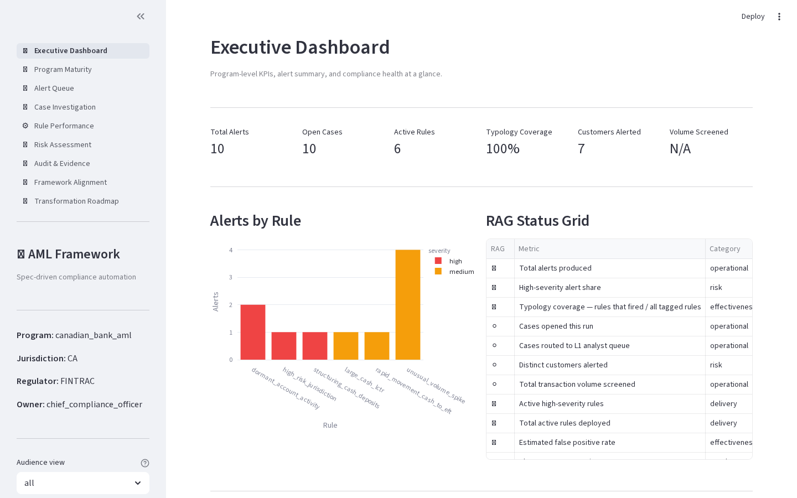

The **Framework Alignment** page shows **PCMLTFA Pillars** and **OSFI Guideline B-8**
tabs instead of FinCEN BSA Pillars when running with a Canadian spec:

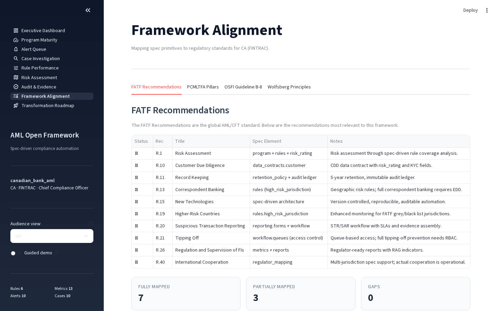

```bash
# Run the Canadian spec
aml dashboard examples/canadian_bank/aml.yaml

# Or from the CLI
aml run examples/canadian_bank/aml.yaml --seed 42
```

## Detection Rules

The example specs include 6 detection rules covering core AML typologies:

| Rule | Typology | Severity | US Citation | CA Citation |
|------|----------|----------|-------------|-------------|
| `structuring_cash_deposits` | Below-threshold cash deposits | High | 31 CFR 1010.314 | PCMLTFA s.11.1, PCMLTFR s.132 |
| `rapid_movement_cash_to_wire` | Cash-in then wire/EFT-out | Medium | FinCEN FIN-2014-A005 | PCMLTFR s.12(1) |
| `high_risk_jurisdiction` | FATF high-risk country activity | High | 31 CFR 1010.610 | PCMLTFA s.9.4, OSFI B-8 |
| `large_cash_ctr` / `large_cash_lctr` | Daily cash > reporting threshold | Medium | 31 CFR 1010.311 ($10k USD) | PCMLTFR s.7(1) ($10k CAD) |
| `unusual_volume_spike` | Volume >5x historical baseline | Medium | FinCEN FIN-2006-A003 | PCMLTFA s.7, PCMLTFR s.123.1 |
| `dormant_account_activity` | Dormant reactivation + large txn | High | FinCEN FIN-2006-A003 | PCMLTFA s.7 |

Each rule specifies evidence requirements and escalation queues with SLAs.

## Metrics & Reporting

13 metrics across 5 categories, each with RAG thresholds and audience routing:

| Category | Metrics |
|----------|---------|
| **Operational** | Total alerts, cases opened, cases routed to L1, transaction volume, SLA compliance rate, avg resolution time |
| **Effectiveness** | Typology coverage, false positive rate |
| **Risk** | High-severity alert ratio, distinct customers alerted |
| **Regulatory** | Alert-to-SAR conversion rate |
| **Delivery** | Active high-severity rules, total active rules |

Reports are rendered per audience (SVP, VP, Director, Manager, PM, Developer,
Business) with RAG indicators and owner accountability.

## Collaboration across roles

The same `aml.yaml` drives:

| Audience     | Artifact                                          |
|--------------|---------------------------------------------------|
| SVP          | `reports/svp_exec_brief.md` (quarterly, RAG)      |
| VP           | `reports/vp_compliance_review.md` (monthly)       |
| Director     | `reports/director_program_health.md` (monthly)    |
| Manager      | `reports/manager_weekly.md` (weekly, queue load)  |
| PM           | `reports/pm_delivery.md` (weekly, catalogue)      |
| Developer    | `reports/developer_runtime.md` (daily runtime)    |
| Business     | `reports/business_owner_daily.md` (customer pulse)|
| Auditor      | `control_matrix.md` + the evidence bundle         |

Every metric in every report is defined once in the spec, with an owner and
RAG thresholds. See [`docs/metrics-framework.md`](docs/metrics-framework.md).

## Repository layout

```
schema/aml-spec.schema.json     JSON Schema for aml.yaml (the contract)
examples/community_bank/        US community bank spec (FinCEN, USD, SAR/CTR)
examples/canadian_bank/         Canadian bank spec (FINTRAC/OSFI, CAD, STR/LCTR/EFTR)
examples/eu_bank/               EU bank spec (EBA/AMLD6, EUR, PEP screening)
examples/uk_bank/               UK bank spec (FCA/POCA/SAMLA, GBP, OFSI sanctions)
src/aml_framework/
  spec/                         Parse + validate the spec (JSON Schema + Pydantic)
  generators/                   Emit SQL, DAG stubs, control matrix, STR narratives
  engine/                       Execute rules on DuckDB, audit ledger
  metrics/                      Metric evaluation engine + report rendering
  cases/                        Case files, reviewer workflow artifacts
  data/                         Synthetic data generator with planted positives
  dashboard/                    Streamlit web dashboard (21 pages)
  models/                       ML scoring callables for python_ref rules
  api/                          FastAPI REST layer with JWT auth
  cli.py                        `aml` command-line entry point
  integrations/                 Jira, Slack/Teams, SIEM/CEF connectors
data/input/                     Sample CSV data for testing (438 txns, 25 customers)
deploy/helm/                    Helm chart for Kubernetes deployment
docs/
  architecture.md               Reference architecture
  personas.md                   Who does what
  regulator-mapping.md          FinCEN / FINTRAC / OFAC / AMLD6 coverage
  spec-reference.md             Field-by-field spec guide
  metrics-framework.md          Metric types, RAG thresholds, audience model
  audit-evidence.md             Evidence bundle specification
  screenshots/                  Dashboard screenshots
```

## Testing

The framework has three layers of tests:

```bash
# Unit + API tests (~250 tests across 8 modules)
pytest tests/ --ignore=tests/test_e2e_dashboard.py -q

# Dashboard e2e tests via Playwright (21 tests, needs: pip install playwright && python -m playwright install chromium)
pytest tests/test_e2e_dashboard.py

# All tests
pytest tests/
```

| Layer | Tests | What It Covers |
|-------|-------|----------------|
| **Unit/Integration** | 27 | Spec validation, all rule types (aggregation_window, custom_sql, python_ref, list_match), metrics, planted positives, reproducibility |
| **API E2E** | 9 | FastAPI health, JWT auth (login/reject/all users), run creation, error handling |
| **Dashboard E2E (Playwright)** | 23 | All 21 pages render without errors, sidebar nav, KPI cards, charts, network graph, sanctions matches, model scores, data quality checks |

## Status

Reference implementation — not a certified compliance product. Use it to
prototype controls, drive internal conversations, or anchor a spec-first
migration of an existing AML program. Any production deployment needs
institution-specific tuning, model validation, and sign-off from your 2nd line.

## License

Apache-2.0.
