# Reference Architecture

> **Live interactive version** — full design with hover states + body copy at [`/research/architecture`](https://tomqwu.github.io/aml_open_framework_demo/#/research/architecture) on the demo site. The image above is the canonical diagram; the Mermaid below is the textual spec for accessibility.

## Principle

**The Compliance Manifest is the source of truth.** Policy, data contracts, detection rules,
case workflow, and regulator mapping live in one versioned document — the
Compliance Manifest (an `aml.yaml` file, for engineers). Every
runtime artifact — SQL, DAGs, data-quality tests, dashboards, alert payloads,
audit ledger entries — is *generated* from the Manifest, never hand-written in
parallel. This is what kills the drift that causes AML fines.

## Layered view

```mermaid
flowchart TD
    subgraph POLICY["📜 POLICY LAYER · aml.yaml (plain YAML · reviewed via PR)"]
        direction LR
        P1[program metadata<br/>jurisdiction · regulator · owner]
        P2[data_contracts<br/>tables · columns · SLAs · PII]
        P3[rules<br/>logic + regulation citations]
        P4[workflow<br/>queues · SLAs · escalations]
        P5[reporting<br/>SAR · CTR · STR forms]
    end

    subgraph GEN["⚙️ GENERATION LAYER · spec → artifacts (deterministic)"]
        direction LR
        G1[sql_generator<br/>→ rule SQL · DuckDB · Snowflake]
        G2[dag_generator<br/>→ Airflow · Dagster stubs]
        G3[tests_generator<br/>→ data-quality + fixtures]
        G4[docs_generator<br/>→ persona-specific markdown]
        G5[control_matrix<br/>→ auditor-facing mapping]
        G6[mrm_dossier<br/>→ per-rule MRM bundle]
    end

    subgraph RUN["⚡ RUNTIME LAYER · execute rules · produce alerts + cases"]
        direction LR
        R1[ingest<br/>data contract enforced<br/>+ ISO 20022 native]
        R2[rule engine<br/>windowed aggregations · joins · network]
        R3[case manager<br/>queues · SLAs · reviewer notes]
        R4[BOI workflow<br/>beneficial-owner refresh]
        R5[tuning lab<br/>backtester + threshold sweeps]
        R6[regulator export<br/>SAR bundle · audit-pack CLI]
    end

    subgraph EV["🔒 EVIDENCE LAYER · immutable audit ledger · signed manifests"]
        direction LR
        E1[spec_version_hash<br/>git SHA + content hash]
        E2[input_hash<br/>data snapshot hash]
        E3[rule_output_hash<br/>deterministic-rerun proof]
        E4[decision_log<br/>reviewer actions + reason]
    end

    POLICY ==> GEN
    GEN ==> RUN
    RUN ==> EV

    classDef layer fill:#f6f7f9,stroke:#051c2c,stroke-width:2px,color:#051c2c
    classDef item fill:#ffffff,stroke:#c8cfd6,stroke-width:1px,color:#2b3641,font-size:13px
    class POLICY,GEN,RUN,EV layer
    class P1,P2,P3,P4,P5,G1,G2,G3,G4,G5,G6,R1,R2,R3,R4,R5,R6,E1,E2,E3,E4 item
```

**Who reads which layer:**

| Persona | Layer they author | Layer they verify |
|---|---|---|
| **CCO / MLRO** | Policy (writes the spec) | Evidence (signs decision log) |
| **Engineer / 1LoD** | Generation (runs generators) | Runtime (operates engine) |
| **2LoD / MRM** | — | Generation + Runtime (challenger model) |
| **Internal Audit / Regulator** | — | Evidence (replays history byte-for-byte) |

## What the spec controls

| Concern                         | Where it lives in the spec          | Generated artifact                              |
|---------------------------------|-------------------------------------|-------------------------------------------------|
| Data freshness / SLAs           | `data_contracts[*].freshness_sla`   | Pipeline sensor + alert                         |
| PII classification              | `data_contracts[*].columns[*].pii`  | Column masks, access policy                     |
| Detection logic                 | `rules[*].logic`                    | SQL query + unit fixture                        |
| Regulation traceability         | `rules[*].regulation_refs`          | Control matrix row + audit metadata             |
| Reviewer workflow               | `workflow.queues`                   | Case routing + SLA timers + escalation engine   |
| SAR / CTR reporting             | `reporting.forms`                   | Regulator export templates + audit-pack CLI     |
| ISO 20022 ingestion             | `data_contracts[*].iso20022`        | pacs.008/009/004 + pain.001 validators          |
| Beneficial-owner tracking       | `boi.refresh_policy`                | BOI Workflow page + freshness alerts            |
| Model risk management           | `rules[*].mrm`                      | Per-rule MRM dossier + 4-quarter backtester     |
| Retention                       | `retention_policy`                  | Ledger TTL + export redaction                   |

## Determinism & reproducibility

Every rule execution records:

1. `spec_version` — git SHA of `aml.yaml` plus a content hash.
2. `input_hash` — hash of the ordered input rows used (or snapshot id).
3. `output_hash` — hash of the alert set.
4. `engine_version` — version of this framework.

An auditor can re-run any historical execution and verify the output hash
matches. If it doesn't, the chain of custody is broken and the run is flagged.

## Why not a rules engine in application code?

A pure Python/Java rules engine lets any developer tweak detection logic in a
Monday-morning hotfix, and the CCO only hears about it three audits later.
Declarative specs with PR-based review force a control point: policy changes
go through compliance sign-off *before* they change pipeline behaviour. The
same argument is why Terraform, dbt, and Kubernetes manifests won — spec > code
for regulated change.

## Extensibility

Two escape hatches, by design:

- **`custom_sql`** on a rule lets an engineer drop in handwritten SQL when the
  declarative logic primitives aren't expressive enough. The spec still
  carries the regulation citation, severity, workflow, and evidence list, so
  the audit trail survives.
- **`python_ref`** on a rule points at a Python callable (e.g. an ML scorer)
  that returns an alert set. The spec captures the model id and version so
  model risk management can validate it.

Both escape hatches mean some generation properties weaken (e.g. the control
matrix can't auto-extract thresholds), but the policy layer is preserved.

## What this framework is *not*

- **Not a replacement for a core banking system or transaction store.** It
  reads from whatever warehouse you have.
- **Not a certified detection model catalogue.** Rules in the examples are
  illustrative starting points, not validated typologies.
- **Not a SAR filing service.** It produces a well-formed bundle; the
  regulatory submission step is institution-specific.

See [`personas.md`](personas.md) for the role-by-role interaction model and
[`regulator-mapping.md`](regulator-mapping.md) for regime-specific notes.
