# Dashboard Tour

The Streamlit dashboard runs the full engine on startup and surfaces results across **22 purpose-built pages**. The sidebar **Audience** selector hides pages outside your persona's primary workflow.

```bash
pip install -e ".[dev,dashboard]"
aml dashboard examples/community_bank/aml.yaml
# Opens at http://localhost:8501
```

For multi-tenant deployments showing more than one program in the same dashboard process, see the **Tenant** selector at the top of the sidebar (configured via `dashboard_tenants.yaml`).

---

## Operational Pages

### Executive Dashboard

Program-level KPIs, alert-by-rule breakdown with severity coloring, RAG status grid for all metrics, and a program health radar chart. Audience filtering switches between SVP, VP, Director, Manager, PM, Developer, and Business views.

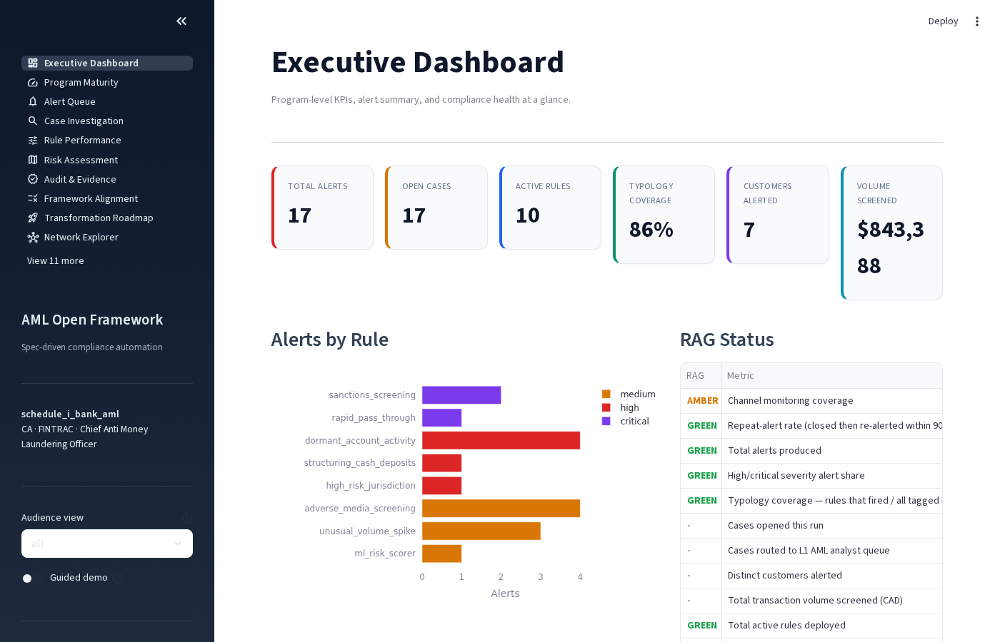

### Alert Queue

Filterable, sortable alert triage view for L1 analysts. Filter by rule or severity, view aggregated amounts and time windows, and drill into individual alerts. Charts show alert volume by rule and severity distribution.

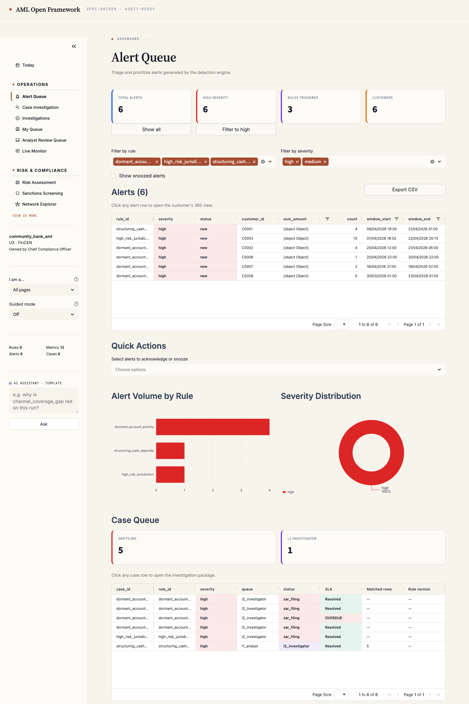

### Case Investigation

Per-case investigation workspace with entity profile (customer details, risk rating, country), alert details (regulation citations, evidence requested), transaction timeline with alert window highlighting, Sankey flow diagram showing channel-level fund movement, and evidence panel.

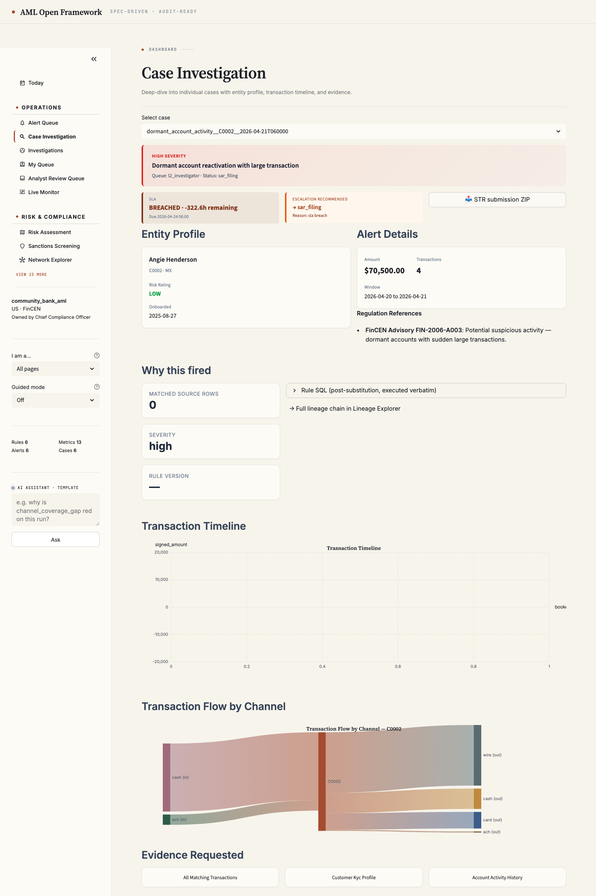

### Investigations (Round-6)

Aggregates per-alert cases into **investigation units** that FinCEN's effectiveness rule and FCA's Mar 2026 Dear CEO letter both treat as canonical. Three sections:
- Queue backlog table with green/amber/red/breached counts per workflow queue
- Investigations list sorted by severity → total amount
- Drill-down with per-constituent-case live SLA state + escalation recommendation

Sidebar exposes aggregation strategy (`per_customer_window` / `per_customer_per_run` / `per_case`) and an "evaluate SLA against now()" toggle for live-ops vs backtest view.

### My Queue (Analyst Dashboard)

Personal analyst dashboard showing assigned cases, open/resolved counts, SLA compliance percentage, and resolution time distribution. Select your queue to see cases by severity, recent activity log, and workload charts.

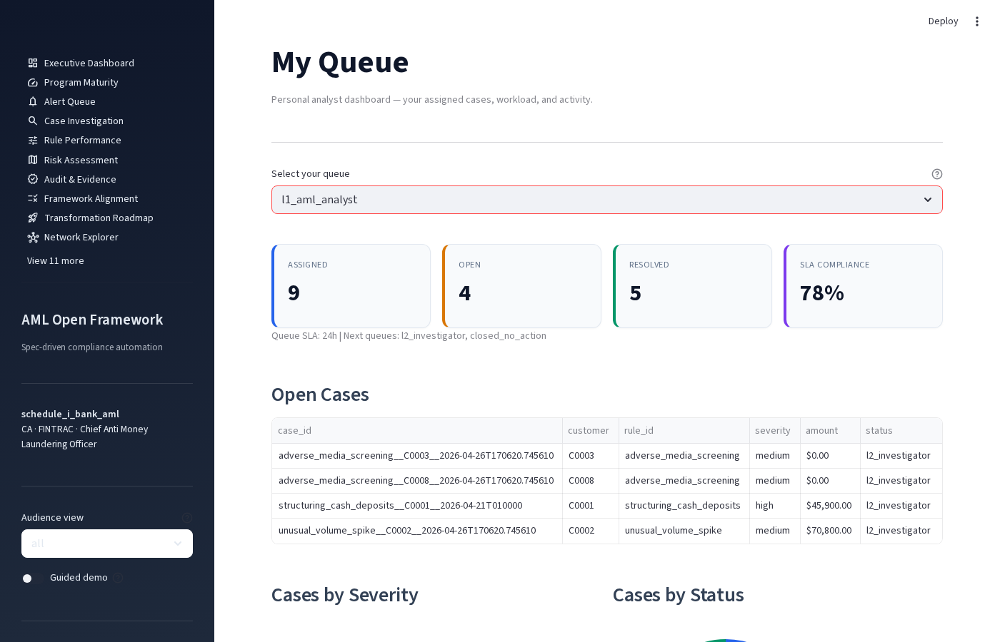

### Customer 360

Complete single-customer view: profile card with risk rating, transaction history chart + table, alerts triggered, open cases, and channel breakdown. Used by analysts for investigation prep.

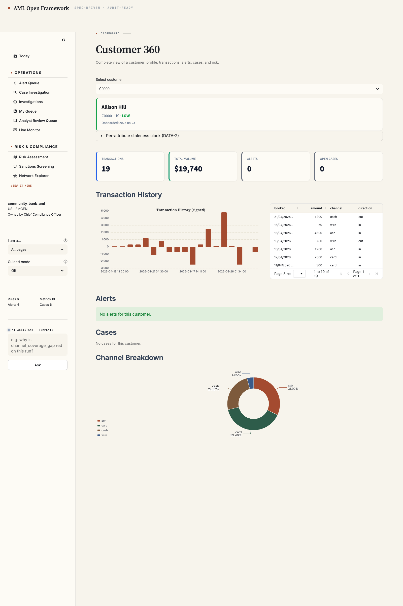

### Live Monitor

Real-time transaction monitoring simulation with **spec-derived alert conditions**. Screening rules are extracted from the spec's `aggregation_window` filters and `having` thresholds. An expandable panel shows which rules drive the screening.

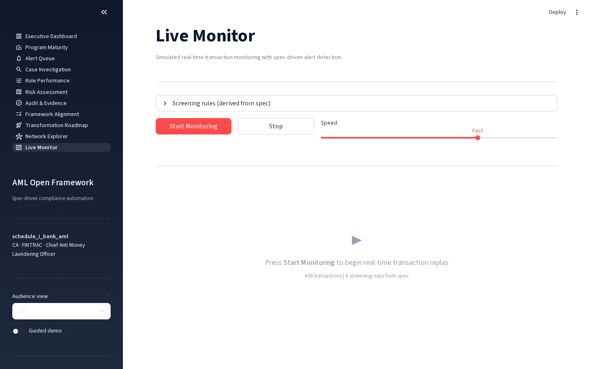

### Sanctions Screening

Executes `list_match` rules against reference sanctions lists (SEMA, OFAC SDN) with exact or fuzzy (token-overlap) matching. Shows match results with confidence scores, matched customer profiles, and the screening rules from the spec.

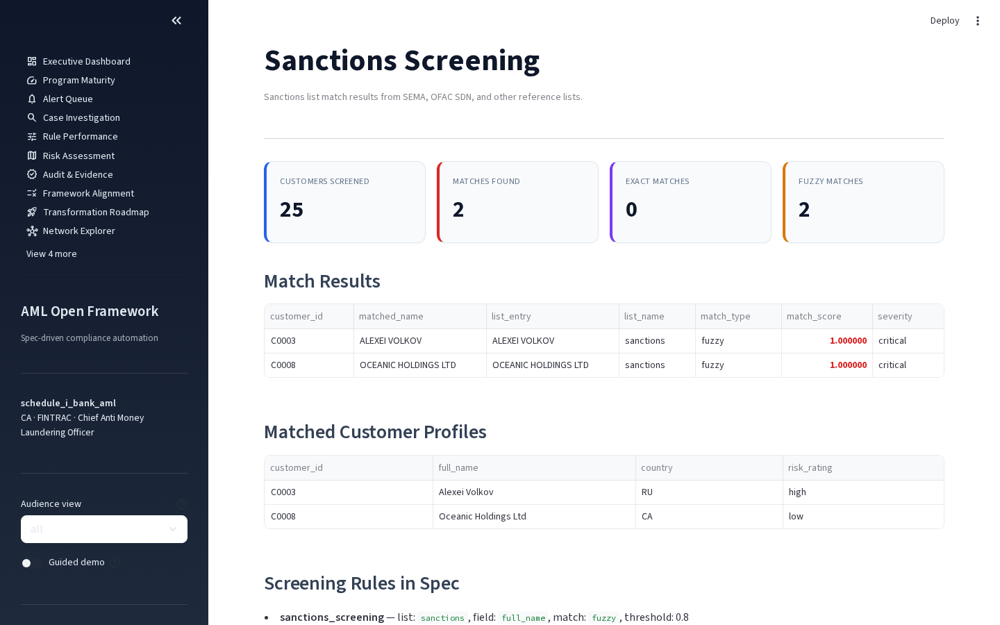

### Network Explorer

Interactive entity relationship graph built with `networkx` and `streamlit-agraph`. Edges represent **temporal correlation** (outflow from one customer followed by inflow to another within 1 hour) — this is how pass-through and layering patterns surface. Fan-in detection counts distinct correlated counterparties.

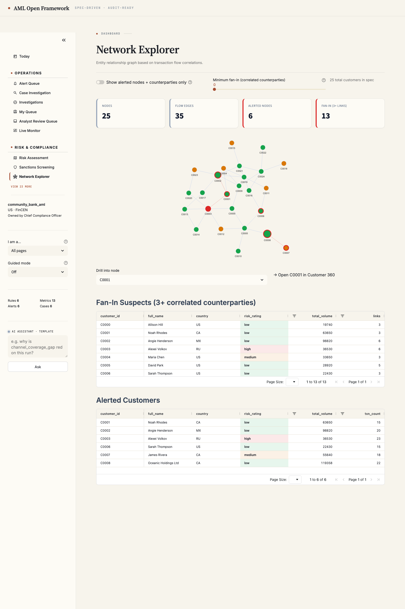

---

## Strategic Pages

### Program Maturity Assessment

12-dimension maturity spider chart based on Big-4 consulting firm methodologies (Deloitte, EY, PwC, KPMG). Current scores are derived from spec coverage (number of active rules, workflow queues, data quality checks). Target scores show where the program needs to be. Expandable dimension cards provide assessment rationale and recommendations.

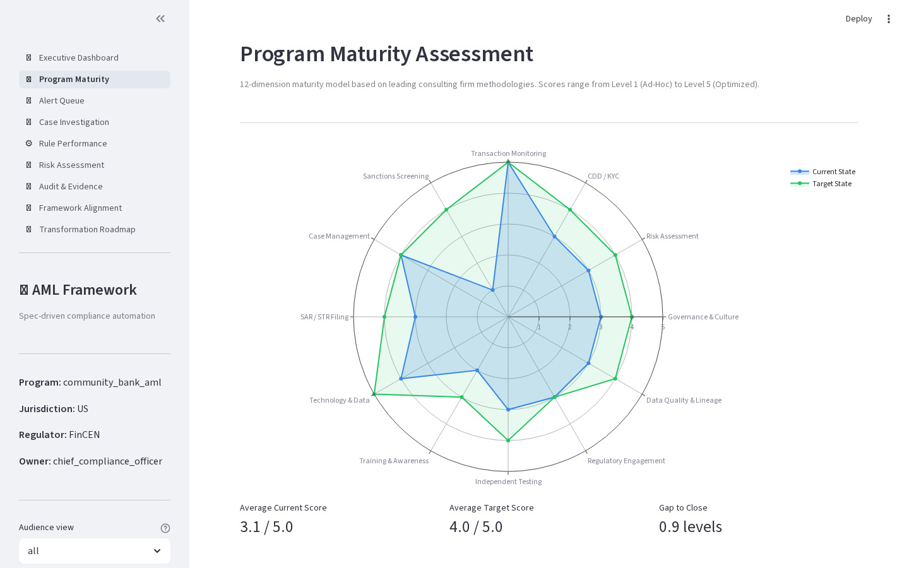

### Risk Assessment

Customer risk distribution (low/medium/high), geographic exposure by country, transaction volume heatmap (risk rating × channel), and a table of all alerted customers with their profiles.

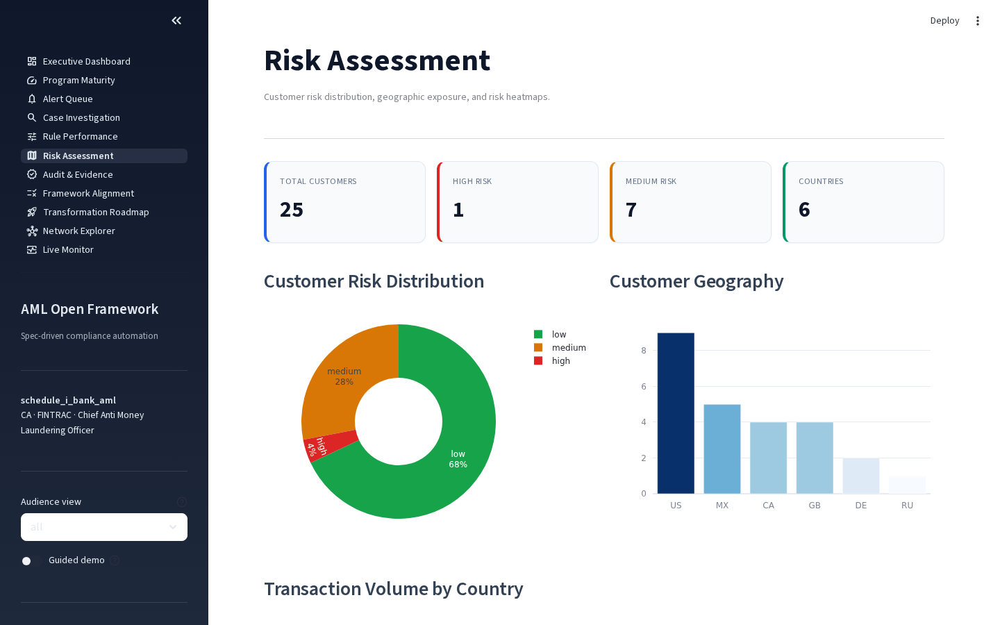

### Framework Alignment

Three-tab mapping of spec primitives to international regulatory standards:
- **FATF 40 Recommendations** — 10 key recommendations mapped with coverage status
- **FinCEN BSA 6 Pillars** — including the April 2026 proposed 6th pillar (formalized risk assessment)
- **AMLD6 Requirements** — 7 EU articles mapped (Art.8 Risk Assessment through Art.50 STR)
- **Wolfsberg Principles** — 8 principles with gap identification

Tabs auto-switch based on jurisdiction (US → FinCEN BSA, CA → PCMLTFA/OSFI, EU → AMLD6).

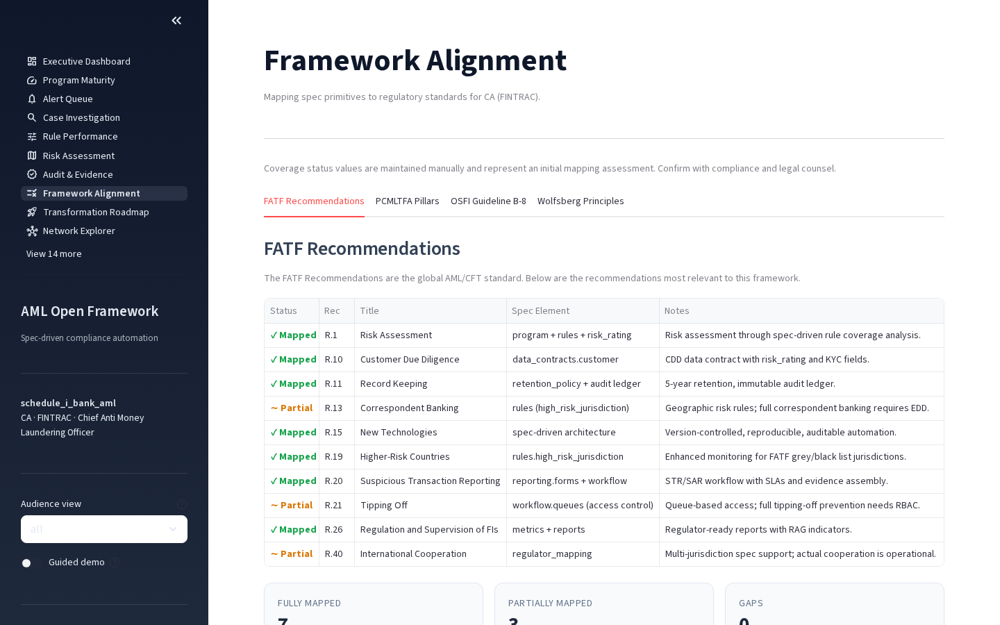

### Transformation Roadmap

4-phase Gantt chart following Big-4 AML program transformation patterns: Assessment (Weeks 1-4), Foundation (Weeks 5-16), Advanced Analytics (Weeks 17-30), Optimization (Weeks 31-52). Each phase includes milestones, deliverables, and status tracking.

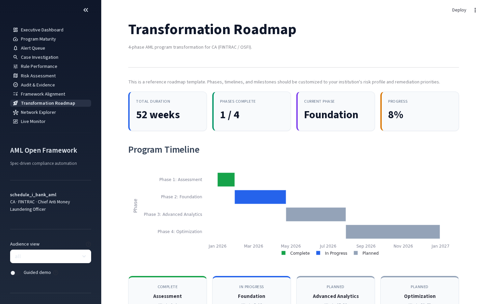

### Comparative Analytics

Run-over-run comparison showing metrics vs targets, RAG distribution, and per-rule alert counts. With stored run history, shows trends over time.

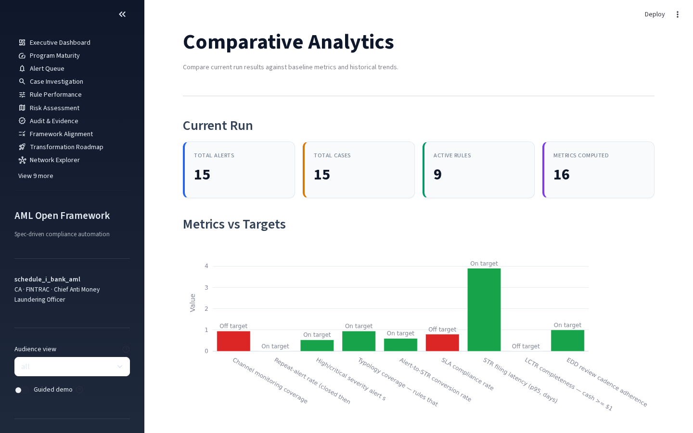

### Typology Catalogue

Pre-built library of 20+ AML detection rule templates across 9 categories: structuring, layering, shell companies, sanctions/PEP, behavioral anomalies, trade-based ML, mule activity, crypto/virtual assets, and geographic risk. Browse templates and add to your spec with institution-specific thresholds.

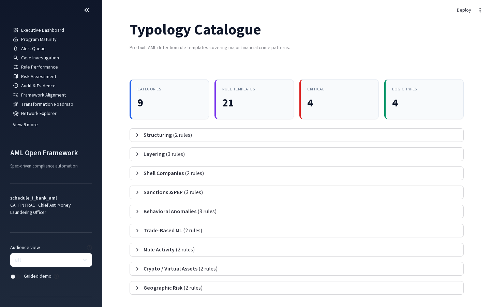

---

## Engineering Pages

### Rule Performance

Per-rule analytics table showing alert counts, detection rates, and logic types. Severity distribution charts, detection coverage by logic type, and a rule-to-regulation cross-reference matrix. Typology tag coverage shows which declared typologies have active detection.


### Rule Tuning

Interactive threshold what-if analysis. Select an `aggregation_window` rule, adjust thresholds with sliders, and see the alert count change in real time. Sensitivity analysis chart shows threshold vs alert volume trade-off. Does not modify the spec — shows impact for review before YAML edit.

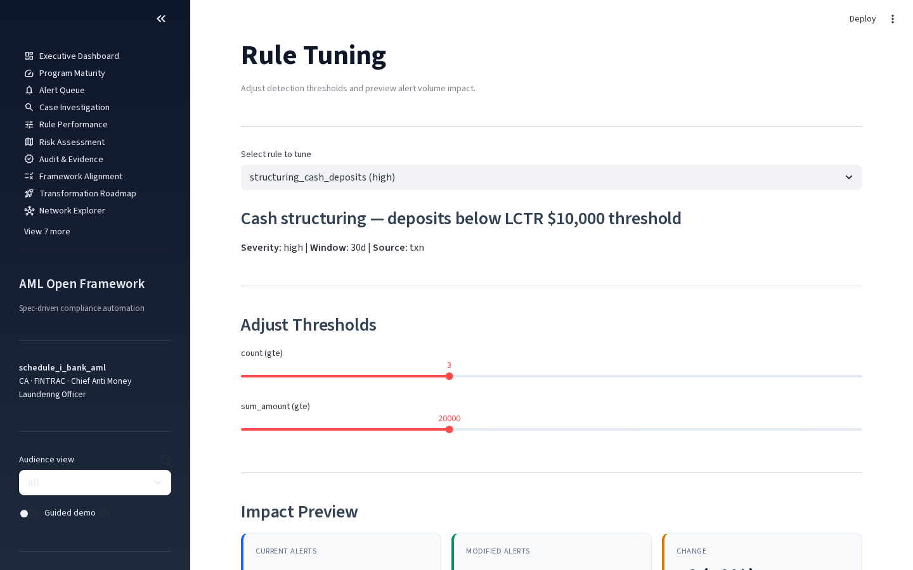

### Spec Editor & Rule Builder

Edit the AML spec YAML in-browser with live validation. The interactive **Rule Builder** generates YAML snippets for all 4 rule types (`aggregation_window`, `custom_sql`, `list_match`, `python_ref`) — configure fields, thresholds, and escalation targets through a form UI.

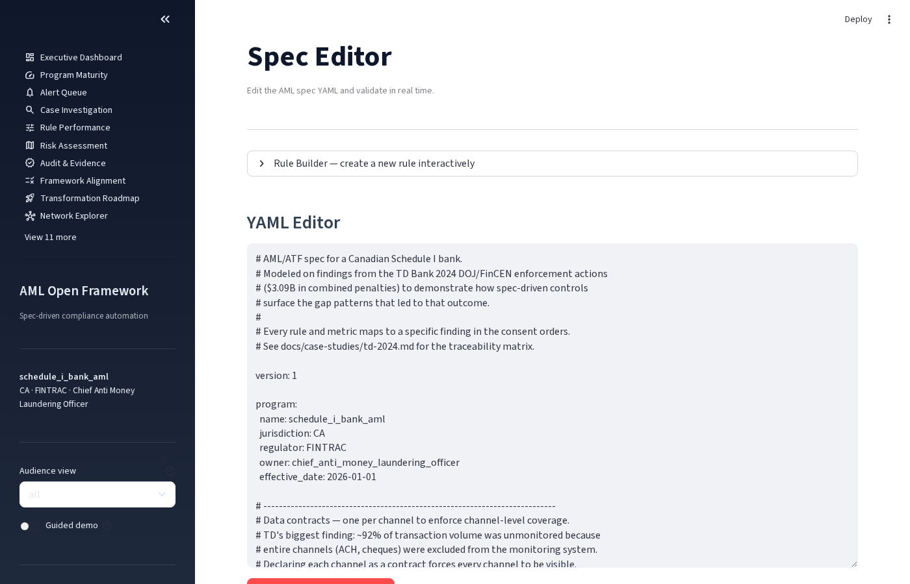

### Model Performance

ML model analytics for `python_ref` rules: model inventory with version tracking, score distribution histograms with threshold markers, per-alert details, and model risk management metadata (model_id, version, callable, regulation citations).

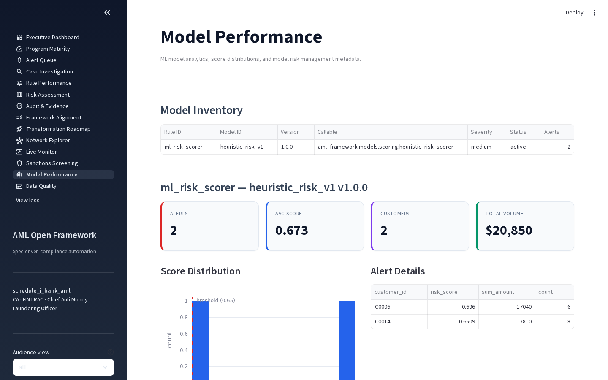

### Data Quality

Executes data contract quality checks (`not_null`, `unique` constraints) against actual data. Shows PASS/FAIL per check, freshness SLA compliance with breach detection, and column-level statistics (non-null count, unique values, types).

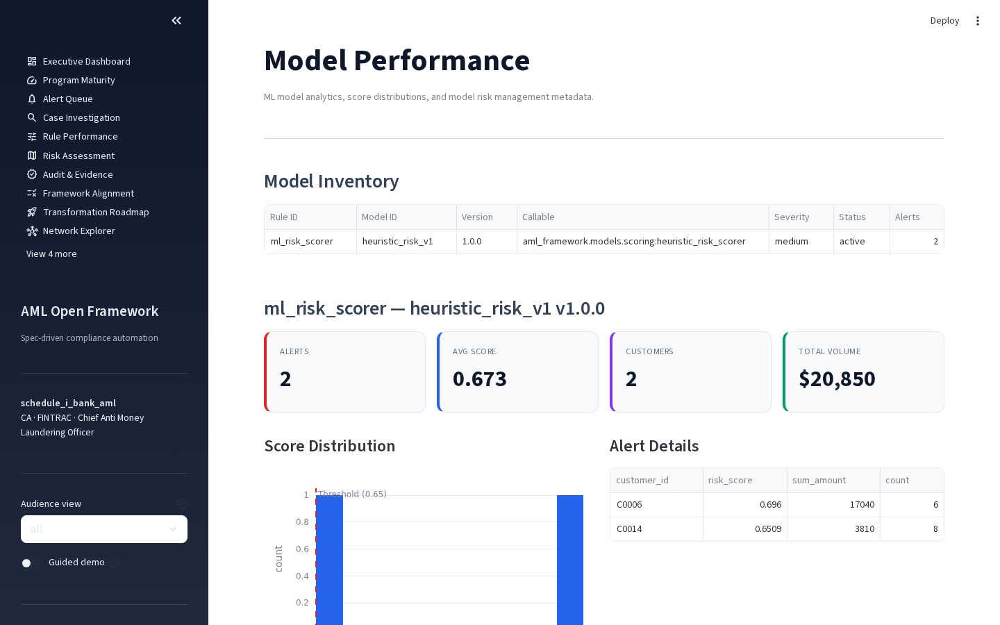

### Run History

Past engine executions from the persistence layer (SQLite locally, PostgreSQL in production). Shows current session metadata, stored runs with spec hashes, and run manifest for audit traceability.

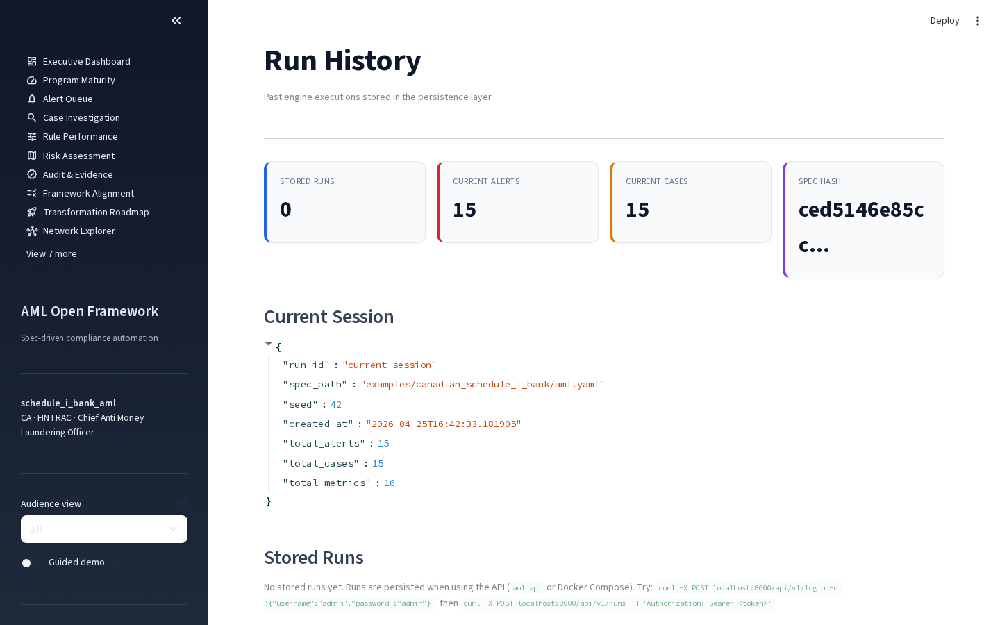

---

## Audit Pages

### Audit & Evidence

Full run manifest with JSON viewer, SHA-256 hash verification for every rule output, append-only decision log, evidence bundle file tree with byte sizes, and the spec snapshot captured at execution time. This is the auditor and regulator view.

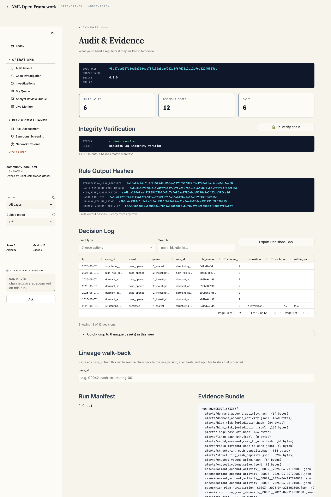

### Analyst Review Queue

Network-pattern alerts get an explainability surface: the matched subgraph rendered as a Mermaid diagram, alongside the alert payload and an analyst decision form (escalate / close / request more evidence). Composes with `engine/explain.py:to_mermaid`.

### Tuning Lab

Pareto-frontier exploration of rule threshold combinations. Loads labelled historical alerts, sweeps thresholds across the spec's `tuning_grid`, and plots true-positive rate × false-positive rate. Used to defend threshold choices in model risk management reviews.

---

## Export Surface

### Board PDF Export

Generate a board-ready PDF report from the Executive Dashboard with program overview, key metrics (RAG-colored), case summary, and maturity assessment. Uses `reportlab` for professional formatting.

---

## Audience Filtering

The same 22 pages serve 6 distinct personas. The sidebar **Audience** selector hides non-relevant pages so each role sees a focused workflow:

| Persona | Primary pages |
|---|---|
| **CCO / SVP** | Executive Dashboard → Program Maturity → Framework Alignment → Transformation Roadmap |
| **VP / Director** | Executive Dashboard → Rule Performance → Risk Assessment → Audit & Evidence |
| **Operations Manager** | Alert Queue → Investigations → Risk Assessment → My Queue → Tuning Lab |
| **L1 Analyst** | Alert Queue → Case Investigation → Investigations → Network Explorer → Customer 360 → My Queue |
| **Auditor** | Audit & Evidence → Data Quality → Framework Alignment → Run History |
| **Developer** | Rule Performance → Model Performance → Data Quality → Run History |

See [`personas.md`](personas.md) for the full role-based workflows.
