# Dashboard Tour

The Streamlit dashboard runs the full engine on startup and surfaces results across **41 purpose-built pages**. The sidebar **Audience** selector hides pages outside your persona's primary workflow. (Two additional pages — Welcome and Today — are navigation surfaces, not described here.) Every page also mounts the GenAI Assistant in the sidebar (PR-K) — backend selectable via `AML_AI_BACKEND`, audit-logged per spec.

The sidebar carries two external links — **Research & whitepapers** and **How-to recipes** — pointing at the MkDocs docs site at `tomqwu.github.io/aml_open_framework_docs/` (`AML_DOCS_URL` env override). Round 32 (2026-05-24) retired the in-app Knowledge category — the 10 pages 33–42 ported from the old GH-Pages site in PR-U2/U3 — once the docs site shipped in Round 31. Knowledge content lives in one canonical place now; the dashboard owns the operational/run-coupled surfaces only.

```bash
pip install -e ".[dev,dashboard]"
aml dashboard examples/community_bank/aml.yaml
# Opens at http://localhost:8501
```

For multi-tenant deployments showing more than one program in the same dashboard process, see the **Tenant** selector at the top of the sidebar (configured via `dashboard_tenants.yaml`).

---

## Operational Pages

### Executive Dashboard

Program-level KPIs, alert-by-rule breakdown with severity coloring, RAG status grid for all metrics, and a program health radar chart. Audience filtering switches between SVP, VP, Director, Manager, PM, Developer, and Business views.

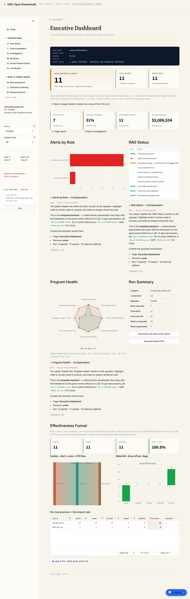

### Alert Queue

Filterable, sortable alert triage view for L1 analysts. Filter by rule or severity, view aggregated amounts and time windows, and drill into individual alerts. Charts show alert volume by rule and severity distribution.

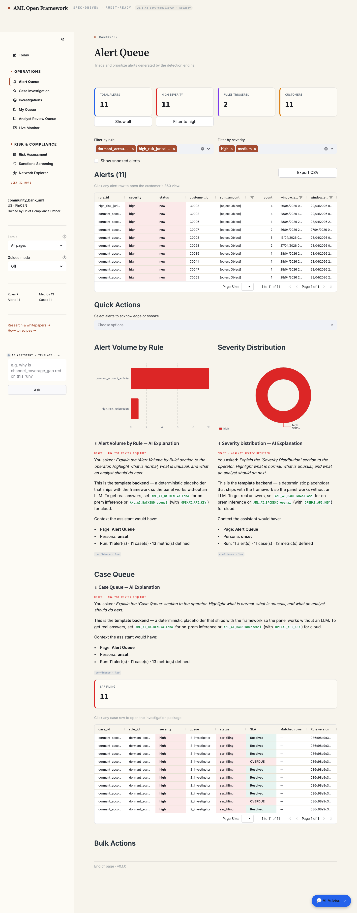

### Case Investigation

Per-case investigation workspace with entity profile (customer details, risk rating, country), alert details (regulation citations, evidence requested), transaction timeline with alert window highlighting, Sankey flow diagram showing channel-level fund movement, and evidence panel.

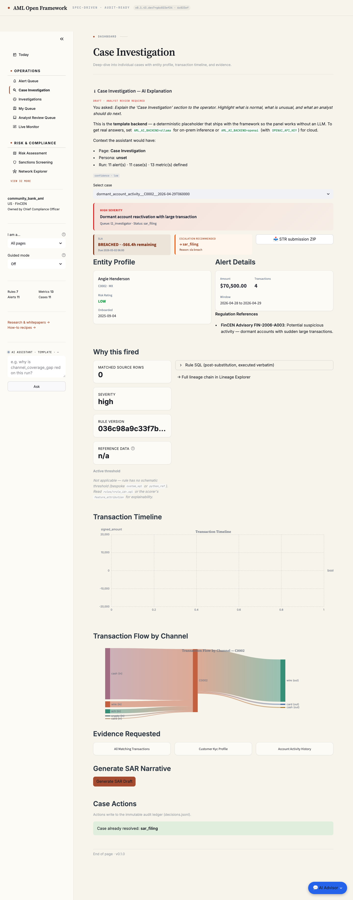

### Investigations (Round-6)

Aggregates per-alert cases into **investigation units** that FinCEN's effectiveness rule and FCA's Mar 2026 Dear CEO letter both treat as canonical. Three sections:
- Queue backlog table with green/amber/red/breached counts per workflow queue
- Investigations list sorted by severity → total amount
- Drill-down with per-constituent-case live SLA state + escalation recommendation

Sidebar exposes aggregation strategy (`per_customer_window` / `per_customer_per_run` / `per_case`) and an "evaluate SLA against now()" toggle for live-ops vs backtest view.

### My Queue (Analyst Dashboard)

Personal analyst dashboard showing assigned cases, open/resolved counts, SLA compliance percentage, and resolution time distribution. Select your queue to see cases by severity, recent activity log, and workload charts.

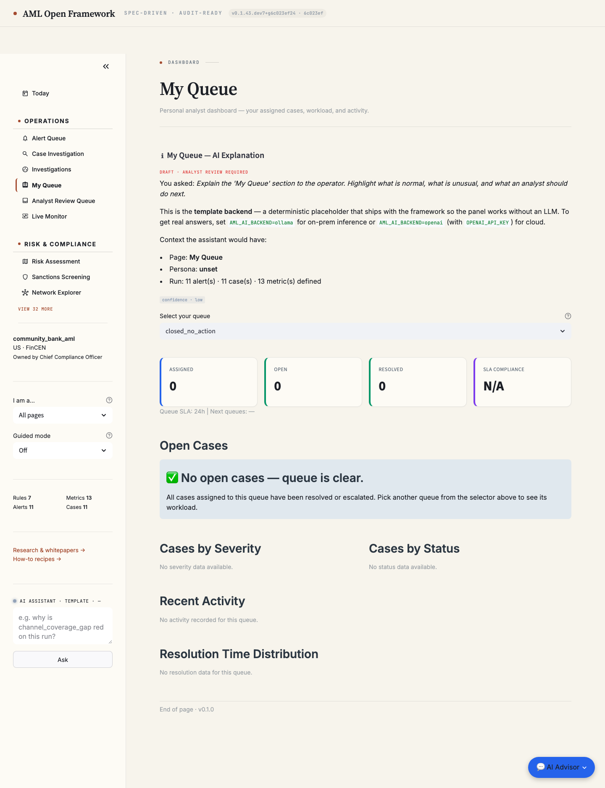

### Customer 360

Complete single-customer view: profile card with risk rating, transaction history chart + table, alerts triggered, open cases, and channel breakdown. Used by analysts for investigation prep.

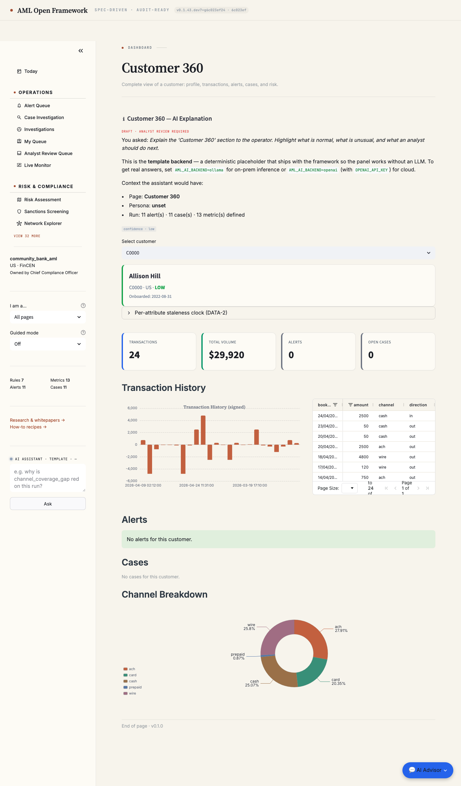

### Live Monitor

Real-time transaction monitoring simulation with **spec-derived alert conditions**. Screening rules are extracted from the spec's `aggregation_window` filters and `having` thresholds. An expandable panel shows which rules drive the screening.

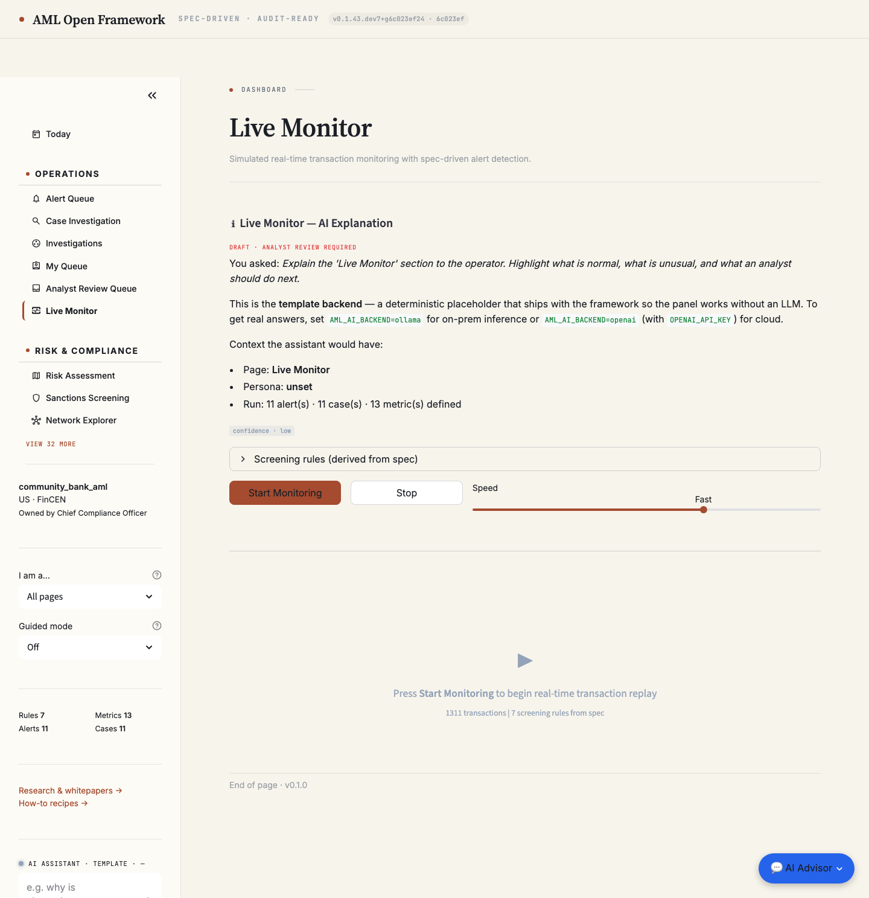

### Sanctions Screening

Executes `list_match` rules against reference sanctions lists (SEMA, OFAC SDN) with exact or fuzzy (token-overlap) matching. Shows match results with confidence scores, matched customer profiles, and the screening rules from the spec.

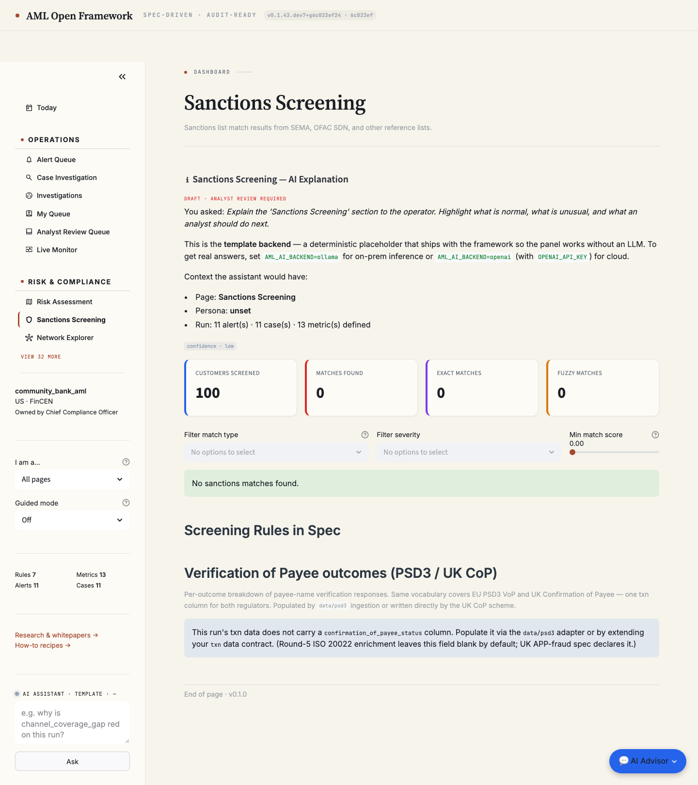

### Network Explorer

Interactive entity relationship graph built with `networkx` and `streamlit-agraph`. Edges represent **temporal correlation** (outflow from one customer followed by inflow to another within 1 hour) — this is how pass-through and layering patterns surface. Fan-in detection counts distinct correlated counterparties.

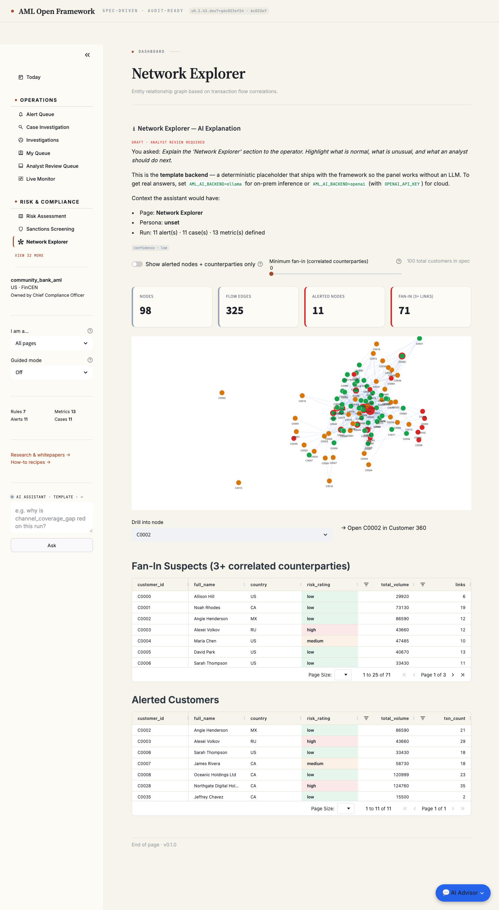

---

## Strategic Pages

### Program Maturity Assessment

12-dimension maturity spider chart based on Big-4 consulting firm methodologies (Deloitte, EY, PwC, KPMG). Current scores are derived from spec coverage (number of active rules, workflow queues, data quality checks). Target scores show where the program needs to be. Expandable dimension cards provide assessment rationale and recommendations.

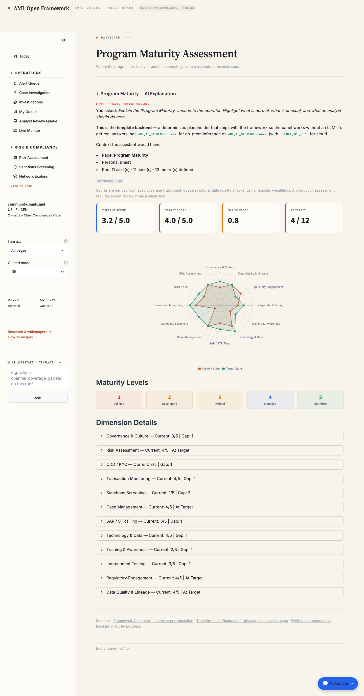

### Risk Assessment

Customer risk distribution (low/medium/high), geographic exposure by country, transaction volume heatmap (risk rating × channel), and a table of all alerted customers with their profiles.

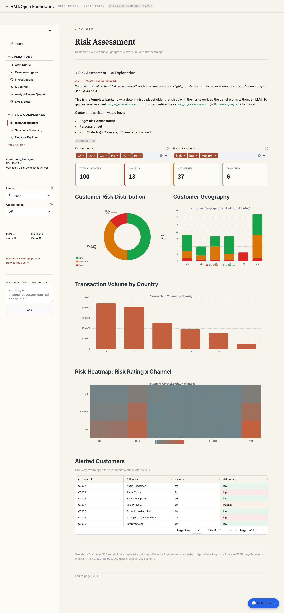

### Framework Alignment

Three-tab mapping of spec primitives to international regulatory standards:
- **FATF 40 Recommendations** — 10 key recommendations mapped with coverage status
- **FinCEN BSA 6 Pillars** — including the April 2026 proposed 6th pillar (formalized risk assessment)
- **AMLD6 Requirements** — 7 EU articles mapped (Art.8 Risk Assessment through Art.50 STR)
- **Wolfsberg Principles** — 8 principles with gap identification

Tabs auto-switch based on jurisdiction (US → FinCEN BSA, CA → PCMLTFA/OSFI, EU → AMLD6).

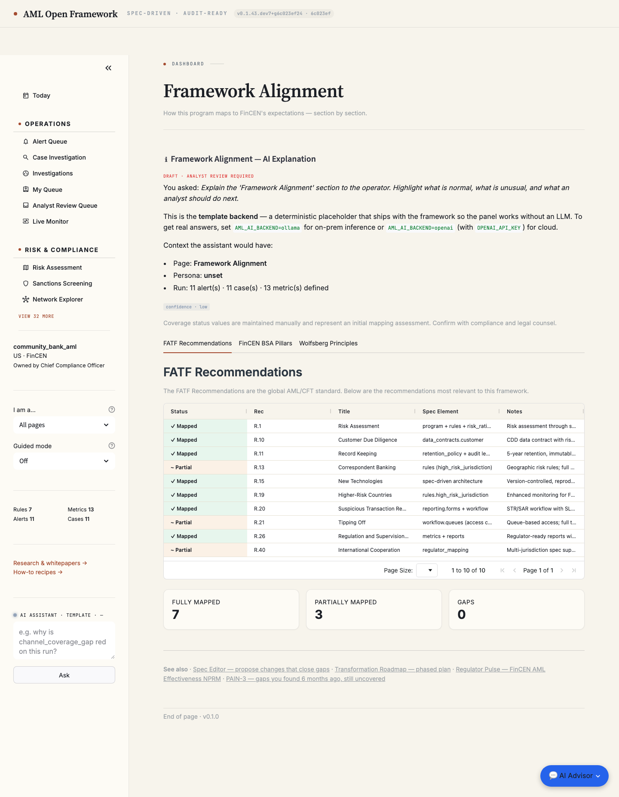

### Transformation Roadmap

4-phase Gantt chart following Big-4 AML program transformation patterns: Assessment (Weeks 1-4), Foundation (Weeks 5-16), Advanced Analytics (Weeks 17-30), Optimization (Weeks 31-52). Each phase includes milestones, deliverables, and status tracking.

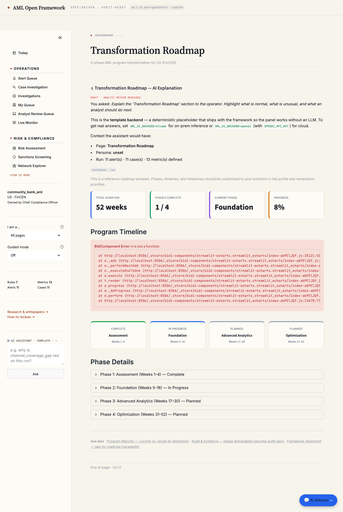

### Comparative Analytics

Run-over-run comparison showing metrics vs targets, RAG distribution, and per-rule alert counts. With stored run history, shows trends over time.

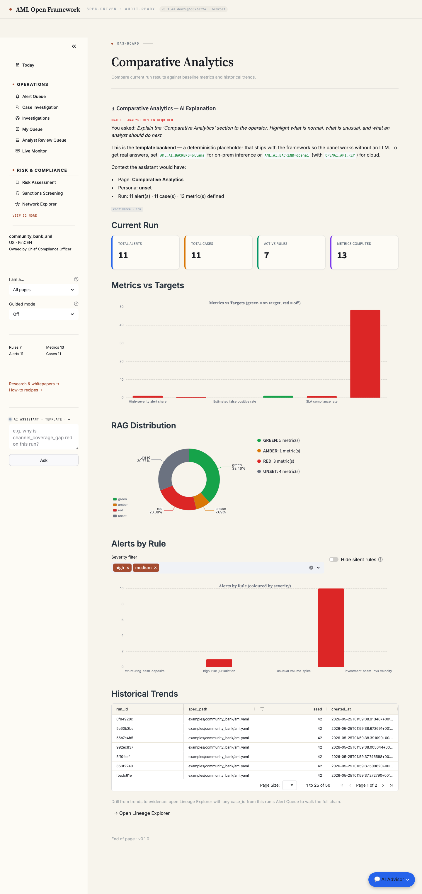

### Typology Catalogue

Pre-built library of 20+ AML detection rule templates across 9 categories: structuring, layering, shell companies, sanctions/PEP, behavioral anomalies, trade-based ML, mule activity, crypto/virtual assets, and geographic risk. Browse templates and add to your spec with institution-specific thresholds.

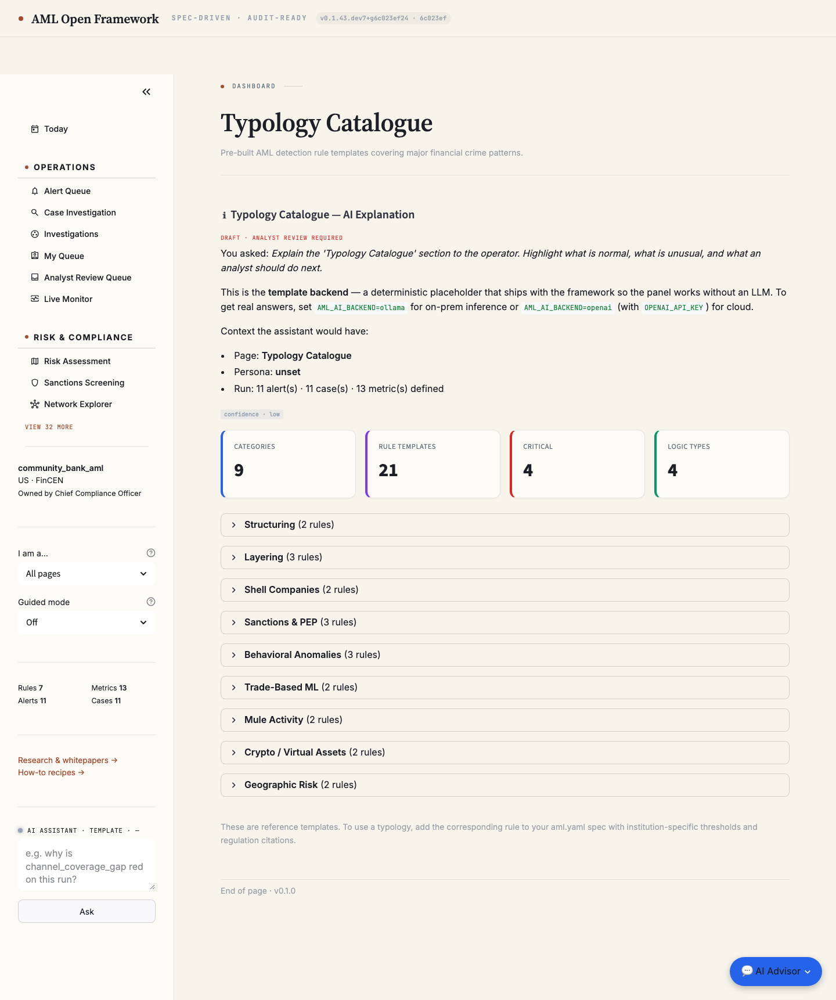

### North Star Coverage

The 8 AML/TM + DS pillars this framework is built around (equivalence-before-optimization, evidence-as-a-product, point-in-time correctness, DQ/reconciliation/defect management, risk-based controls, alert lifecycle & explainability, DS as governed augmentation, serve five roles) — surfaced as 8 cards classified COVERED / PARTIAL / GAP with concrete artefacts from the live spec/run and links to the relevant dashboard pages (PR-NS-1). Read-only synthesis surface — no engine call, no buttons. Live roll-up: **3 COVERED / 5 PARTIAL / 0 GAP** — COVERED are pillar 1 (equivalence — `engine/equivalence.py` + `pages/48_Equivalence.py`, shipped in PR-EQ-3 / Round 27), pillar 6 (alert lifecycle & explainability — flipped PARTIAL → COVERED in PR-PAY-1 / Round 28 once `engine/payload_meta.py` started stamping a uniform `threshold` + `reference_data_version` on every alert across all 5 rule shapes), and pillar 8 (serve five roles — `audience.py` persona routing). The 5 PARTIAL pillars (2 evidence-as-a-product, 3 point-in-time, 4 DQ/defect lifecycle, 5 risk-based controls, 7 DS as governed augmentation) name the missing piece on each card rather than soft-pedalling it — e.g. defect-ticket lifecycle, SCD-2 customer history, first-class `risk_tier`, model-risk approval gates. Routed universally — every persona sees it, same idiom as Today / Executive Dashboard.

_Screenshot: pending — see follow-up._

---

## Engineering Pages

### Rule Performance

Per-rule analytics table showing alert counts, detection rates, and logic types. Severity distribution charts, detection coverage by logic type, and a rule-to-regulation cross-reference matrix. Typology tag coverage shows which declared typologies have active detection.

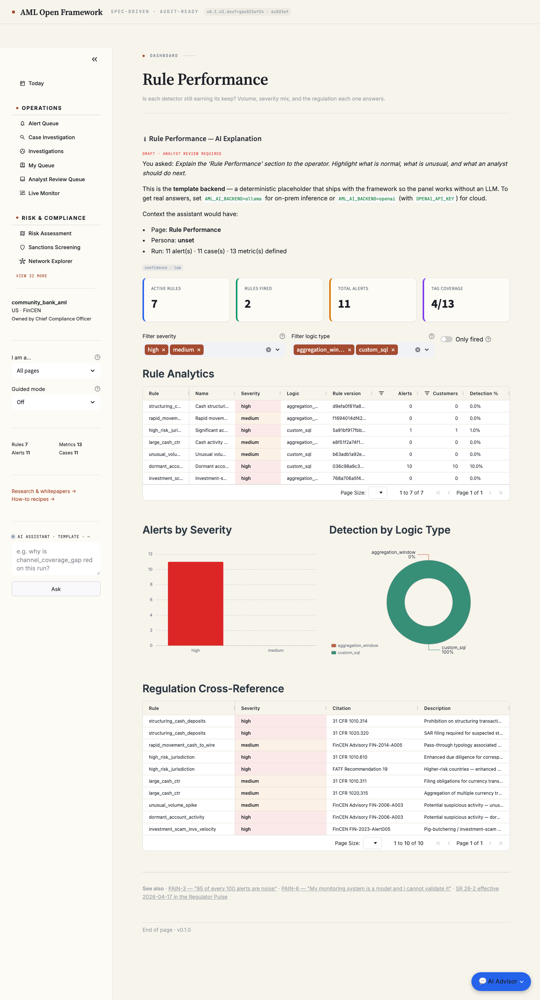

### Rule Lifecycle

Per-rule lifecycle state (active / experimental / deprecated) plus a per-rule approval-workflow placeholder (PR-A4, closes #365). Lifecycle KPI strip counts rules by status; the governance table surfaces `model_tier`, `validation_cadence_months`, `rule_version` (16-hex SHA-256), `business_intent` (truncated), `out_of_scope` exclusion count, and `risk_tier` — deliberately different columns from Rule Performance (alert volume + detection rate) so the two pages complement instead of overlap. Sorted by status (deprecated last, then experimental, then active) so the "rules being tuned right now" band is most visible. The `approval` column is an HONEST placeholder: until the signed-off-version store ships in a follow-up PR, every row reads `⚠ unapproved` — captioned plainly so a reviewer is never misled into thinking the workflow is wired. Cross-links to Spec Editor (modify rules), Rule Performance (per-rule stats), and Tuning Lab (validate experimental rules before promotion). Routed universally — every persona sees it, same idiom as North-Star Coverage.

_Screenshot: pending — see follow-up._

### Rule Tuning

Interactive threshold what-if analysis. Select an `aggregation_window` rule, adjust thresholds with sliders, and see the alert count change in real time. Sensitivity analysis chart shows threshold vs alert volume trade-off. Does not modify the spec — shows impact for review before YAML edit.

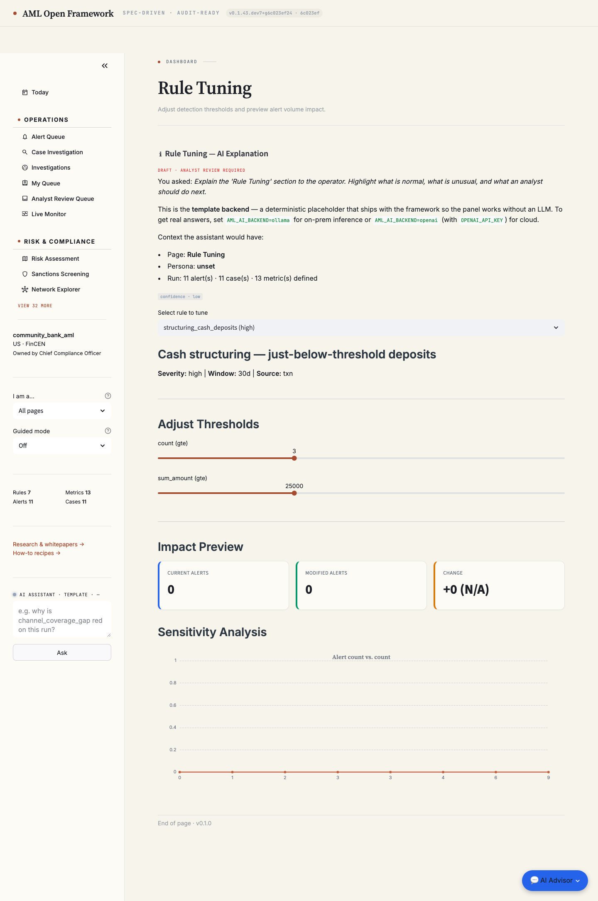

### Spec Editor & Rule Builder

Edit the AML spec YAML in-browser with live validation. The interactive **Rule Builder** generates YAML snippets for all 4 rule types (`aggregation_window`, `custom_sql`, `list_match`, `python_ref`) — configure fields, thresholds, and escalation targets through a form UI.

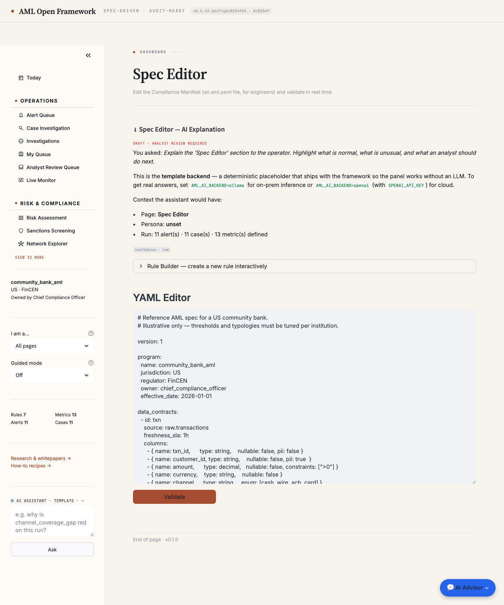

### Model Performance

ML model analytics for `python_ref` rules: model inventory with version tracking, score distribution histograms with threshold markers, per-alert details, and model risk management metadata (model_id, version, callable, regulation citations).

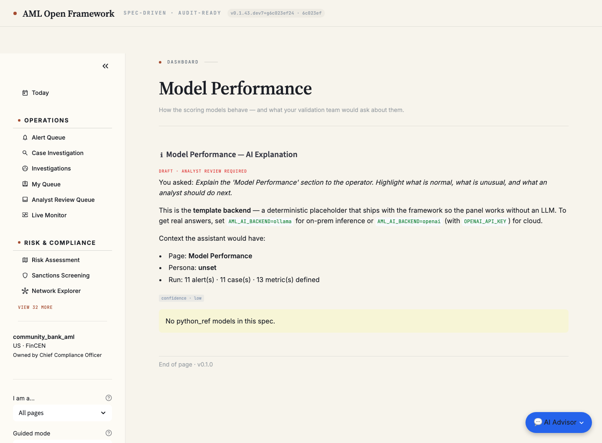

### Data Quality

Executes data contract quality checks (`not_null`, `unique` constraints) against actual data. Shows PASS/FAIL per check, freshness SLA compliance with breach detection, and column-level statistics (non-null count, unique values, types).

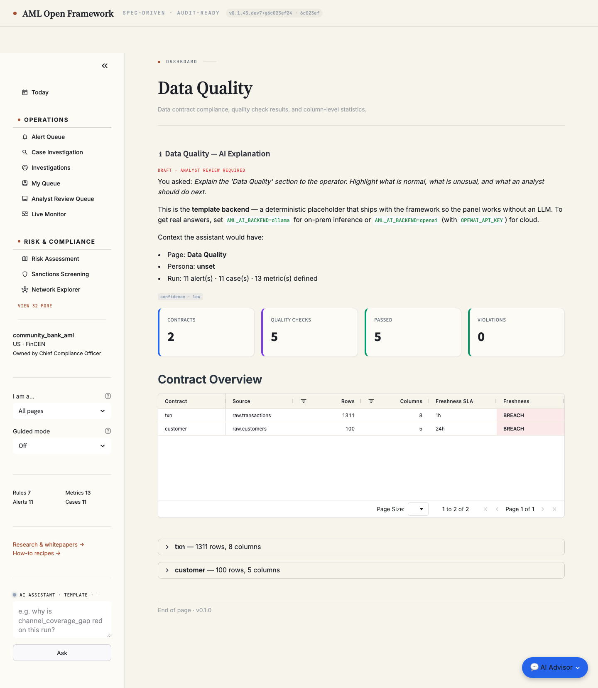

### Data Integration

The 30-second answer to *"what data is flowing through this AML program?"* — built for the Data Engineer / Head of Data persona. Five sections: KPI strip (sources wired / contracts validated / freshness OK / checks passing), source catalogue (the 9 connectors `data/sources.py` ships, with per-connector status), contract roll-up in whitepaper vocabulary (completeness / staleness / checks — avoids the bare phrase "data quality" per the [whitepaper style guide](research/2026-05-aml-data-problem.md)), ISO 20022 message-type counts (pacs.008 / pacs.009 / pacs.004 / pain.001 parsed this run), and a DATA-N → framework artifact map linking each of the 11 whitepaper data pains to the page / CLI command that closes it.

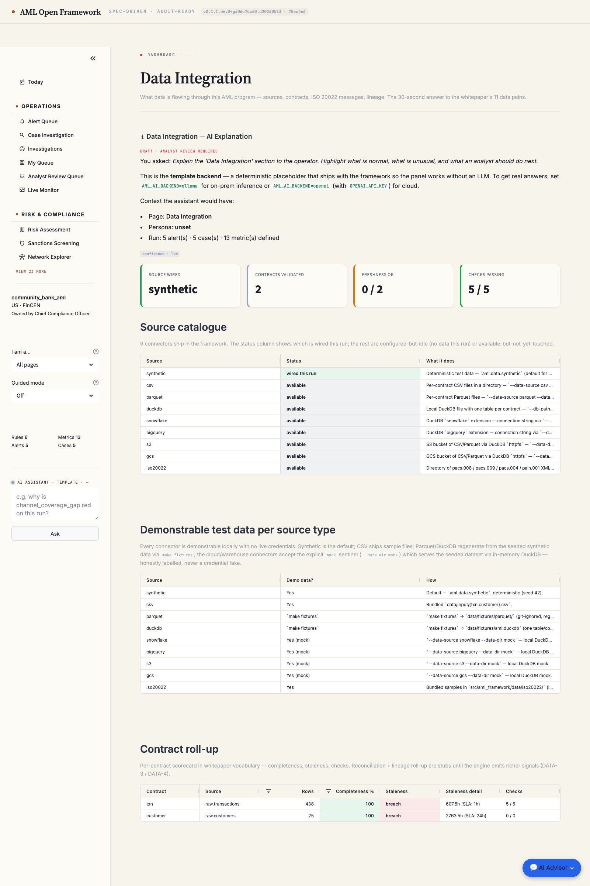

### Run History

Past engine executions from the persistence layer (SQLite locally, PostgreSQL in production). Shows current session metadata, stored runs with spec hashes, and run manifest for audit traceability.

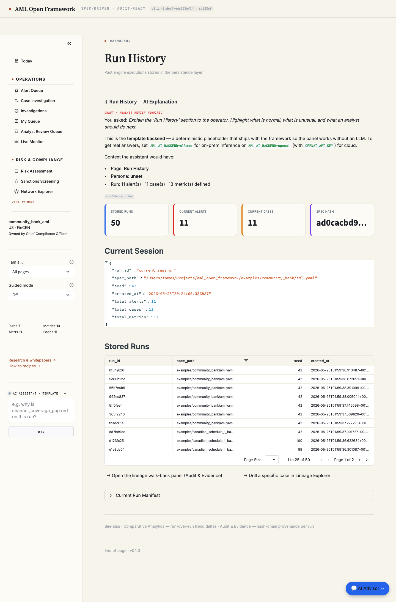

---

## Audit Pages

### Audit & Evidence

Full run manifest with JSON viewer, SHA-256 hash verification for every rule output, append-only decision log, evidence bundle file tree with byte sizes, and the spec snapshot captured at execution time. This is the auditor and regulator view.

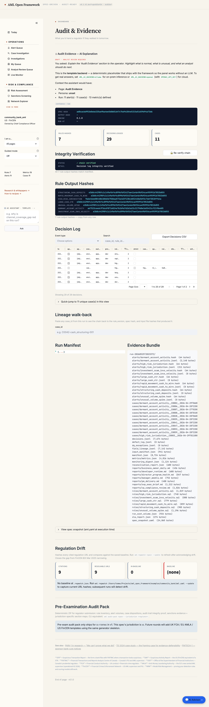

### Lineage Explorer

End-to-end "source → DuckDB table → rendered SQL → matched rows → alert → case → STR" walk-back, deep-linkable from Audit & Evidence and Case Investigation via `?case_id=...`. Mermaid graph + run anchors + source provenance (path + schema_hash + content_hash) + collapsible rule SQL + matched-rows AG Grid + decision timeline + JSON download. Powered by `walk_lineage()` after PR-LIN-1..4 lifted rule_sql, source_path, schema_hash, rule_version (every event), and matched_row_ids into the lineage chain.

### Analyst Review Queue

Network-pattern alerts get an explainability surface: the matched subgraph rendered as a Mermaid diagram, alongside the alert payload and an analyst decision form (escalate / close / request more evidence). Composes with `engine/explain.py:to_mermaid`.

### Tuning Lab

Pareto-frontier exploration of rule threshold combinations. Loads labelled historical alerts, sweeps thresholds across the spec's `tuning_grid`, and plots true-positive rate × false-positive rate. Used to defend threshold choices in model risk management reviews.

### FP Analysis

Per-rule false-positive rate (`closed_no_action ÷ total cases`) derived at render time from the cached `df_cases`. High-FP rules above 70% surface as a coloured callout at the top with a Tuning Lab cross-link; the per-rule table is sortable on the numeric `fp_rate_pct` column so AG Grid orders worst-offenders first. Filing queues are derived from the live spec workflow (any `regulator_form`-bearing queue counts as escalated), so custom STR/SAR/CTR queue ids classify correctly. The Pillar 7 ("DS as governed augmentation") surface that the North-Star coverage page flags as missing. PR-E1 (closes #378). Universally routed — every persona sees it.

---

## Compliance Workflow Pages

### BOI Workflow

Beneficial-Ownership status across reporting-company customers. Single source of truth — Customer 360 + pKYC + freshness window — with one-click FinCEN BOIR-shaped JSON export. Per-customer table sorted worst-first (missing → stale → current); KPI buttons filter the table by status. Stops the re-keying-into-three-systems failure mode the KYC operator hits today.

_Screenshot: pending — see follow-up._

### FinTech Cockpit

1-MLRO operating surface for FinTech / EMI / VASP programs. Sponsor-bank cure-notice timer, the 8 FinTech AML realities (research-doc anchored), and a one-button evidence pack. Built for the persona that IS all three lines of defence — no separate validation team to delegate to.

_Screenshot: pending — see follow-up._

### Regulator Pulse

What's moved in the last 90 days across FinCEN / OCC / FRB / FCA / EBA / AMLA / FINTRAC / FATF. Filterable by jurisdiction, regulator, severity, and event type. Every event cites the regulator's primary source — no industry briefings, no vendor analysis as the load-bearing citation.

_Screenshot: pending — see follow-up._

---

## Reference Pages

### Metrics Taxonomy

Browseable catalogue of every metric the spec declares. KPI strip (total / categories used / with-targets / owners assigned), category × audience × formula filters, per-category accordion of metric cards with live RAG accent + current-run value strip, formula-as-YAML expander per metric, see-also footer cross-linking Executive Dashboard / Comparative Analytics / Spec Editor. Sister page to the Typology Catalogue — what the program *measures* vs what it *detects*.

_Screenshot: pending — see follow-up._

### AI Assistant

Where the dashboard's GenAI co-pilot lives (PR-K). Three sections: (1) backend status — which provider is configured (`template` / `ollama` / `openai`), is the API key set, what's the spec's `program.ai_audit_log` mode; (2) this session's transcript — every Q&A from the sidebar panel, page-tagged; (3) run-level audit trail — tail of `ai_interactions.jsonl` for forensic review. The sidebar panel that appears on every page is for asking; this page is for accountability.

_Screenshot: pending — see follow-up._

### Information Sharing

Cross-bank obfuscated-pattern exchange (PR-DATA-10b). Renders the spec's `information_sharing` block — declared partners, jurisdictions, typology scope, salt-rotation cadence — and the recent `aml share-pattern` artifacts the institution has published. Read-only operational view; production cross-FI exchange (transport, partner discovery, salt rotation infrastructure) is out of scope. Anchored in FATF Recommendation 18 / Wolfsberg CBDDQ V1.4 / FinCEN 314(b) / AMLA cross-border pilot. Empty-states cleanly when the spec doesn't declare information sharing — no spurious surface for institutions that haven't opted in.

_Screenshot: pending — see follow-up._

---

## Knowledge → docs site (retired in-app)

The in-app Knowledge category (10 pages 33–42) was retired in Round 32 once the MkDocs docs site shipped in Round 31. The same content — Compliance Manifest architecture rationale, the AML/TM data-problem whitepaper, competitive positioning, FinTech AML reality, lineage deep-dive, AML process pain, the narrative regulator-pulse brief, the TD 2024 case study, the board-pack business deck (12 slides + 64s video), the engineer technical deck (18 slides + 92s walkthrough) — now lives at:

- **Architecture**: <https://tomqwu.github.io/aml_open_framework_docs/architecture/>
- **Research whitepapers** (under the `Explain` nav):
    - <https://tomqwu.github.io/aml_open_framework_docs/research/2026-05-aml-data-problem/>
    - <https://tomqwu.github.io/aml_open_framework_docs/research/2026-05-regulator-pulse/>
    - <https://tomqwu.github.io/aml_open_framework_docs/research/2026-04-aml-process-pain/>
    - <https://tomqwu.github.io/aml_open_framework_docs/research/2026-04-fintech-aml-reality/>
    - <https://tomqwu.github.io/aml_open_framework_docs/research/2026-04-competitive-positioning/>
    - <https://tomqwu.github.io/aml_open_framework_docs/research/2026-04-regulator-pulse/>
- **Deck PDFs (preserved doors on the docs repo root)**: `/business/`, `/technical/`, `/v1-archive/`

The dashboard sidebar carries two external links (Research & whitepapers · How-to recipes). `AML_DOCS_URL` env override repoints both for private-mirror deploys. The deck PDF assets continue to ship under `docs/pitch/deck-v2/` for download.

---

## Round 27 batch — six universally-routed dashboard surfaces

### Decision Trail

Investigator-facing per-case event chain: case_opened → escalated → STR/SAR filing. Pure read of cached `df_cases` + `df_decisions`. Universal-routed via `AUDIT_TRAIL_PAGES`. PR-F3 (#385).

### Experiment Tracking

MLflow-style overview of every persisted run — spec_content_hash, seed, as_of, total_alerts, total_cases sortable. Universal-routed via `TRACKING_PAGES`. PR-E4 (#381).

### Threshold Sensitivity

Per-rule alert-volume curve across {0.5×, 0.75×, 1.0×, 1.25×, 1.5×, 2.0×} the spec threshold — every tunable `aggregation_window` rule's sensitivity at a glance. Universal-routed via `TUNING_PAGES`. PR-E2 (#379).

### Equivalence

Legacy↔new parallel-run divergence: loads the legacy CSV declared in `program.legacy_reference` and classifies every cell as MATCH / NEW_ONLY / LEGACY_ONLY / DIFF (via `engine/equivalence.py` shipped in PR-EQ-2). Universal-routed via `EQUIVALENCE_PAGES`. PR-EQ-3 (closes pillar 1 gap on the north-star page).

### Anomaly Discovery

Unsupervised z-score outlier detection on per-customer transaction features. Surfaces customers the spec's deterministic rules don't catch — discovery candidates for new rule typologies. Universal-routed via `TUNING_PAGES`. PR-E5 (#382).

### Drift Monitor

Per-scorer alert-volume drift across recent runs. Last-run vs median-of-priors with ≥2× / ≤0.5× thresholds flagged as "high drift". Universal-routed via `TUNING_PAGES`. PR-E3 (#380).

---

## Export Surface

### Board PDF Export

Generate a board-ready PDF report from the Executive Dashboard with program overview, key metrics (RAG-colored), case summary, and maturity assessment. Uses `reportlab` for professional formatting.

---

## Audience Filtering

The 41 operational pages serve 13 distinct personas. The sidebar **Audience** selector hides non-relevant pages so each role sees a focused operational workflow (no persona sees more than 9 operational pages); the cross-cutting synthesis surfaces (North-Star Coverage, FP Analysis, Threshold Sensitivity, Anomaly Discovery, Drift Monitor, Rule Lifecycle, Decision Trail, Experiment Tracking, Equivalence) stay visible to every persona regardless of the filter:

| Persona | Primary pages |
|---|---|
| **SVP** | Executive Dashboard → Program Maturity → Framework Alignment → Transformation Roadmap |
| **CCO** | Executive Dashboard → Program Maturity → Framework Alignment → Risk Assessment → Audit & Evidence → Investigations → Regulator Pulse → Metrics Taxonomy → AI Assistant |
| **CTO** | Executive Dashboard → Program Maturity → Framework Alignment → Model Performance → Run History → Transformation Roadmap |
| **VP / MLRO** | Executive Dashboard → Rule Performance → Framework Alignment → Sanctions Screening → Comparative Analytics → Regulator Pulse → Metrics Taxonomy → AI Assistant |
| **Director** | Executive Dashboard → Alert Queue → Investigations → Risk Assessment → Data Quality → Audit & Evidence → Comparative Analytics → Metrics Taxonomy |
| **Operations Manager** | Alert Queue → Investigations → My Queue → Analyst Review Queue → Risk Assessment → Live Monitor → Tuning Lab → Typology Catalogue → Metrics Taxonomy |
| **L1 Analyst** | Alert Queue → Case Investigation → Investigations → Network Explorer → Sanctions Screening → Customer 360 → My Queue → Analyst Review Queue |
| **Product Manager** | Rule Performance → Program Maturity → Transformation Roadmap → Model Performance → Risk Assessment → Case Investigation → Tuning Lab → Typology Catalogue → Metrics Taxonomy |
| **Developer** | Spec Editor → Rule Performance → Rule Tuning → Tuning Lab → Model Performance → Data Quality → Analyst Review Queue → Run History → AI Assistant |
| **Auditor** | Audit & Evidence → Investigations → Case Investigation → Data Quality → Framework Alignment → Regulator Pulse → Metrics Taxonomy → AI Assistant |
| **Business Owner** | Executive Dashboard → Risk Assessment → Framework Alignment → Audit & Evidence |
| **FinTech MLRO** | FinTech Cockpit → Audit & Evidence → Investigations → Tuning Lab → Regulator Pulse → Spec Editor → Metrics Taxonomy → AI Assistant |

See [`personas.md`](personas.md) for the full role-based workflows.
