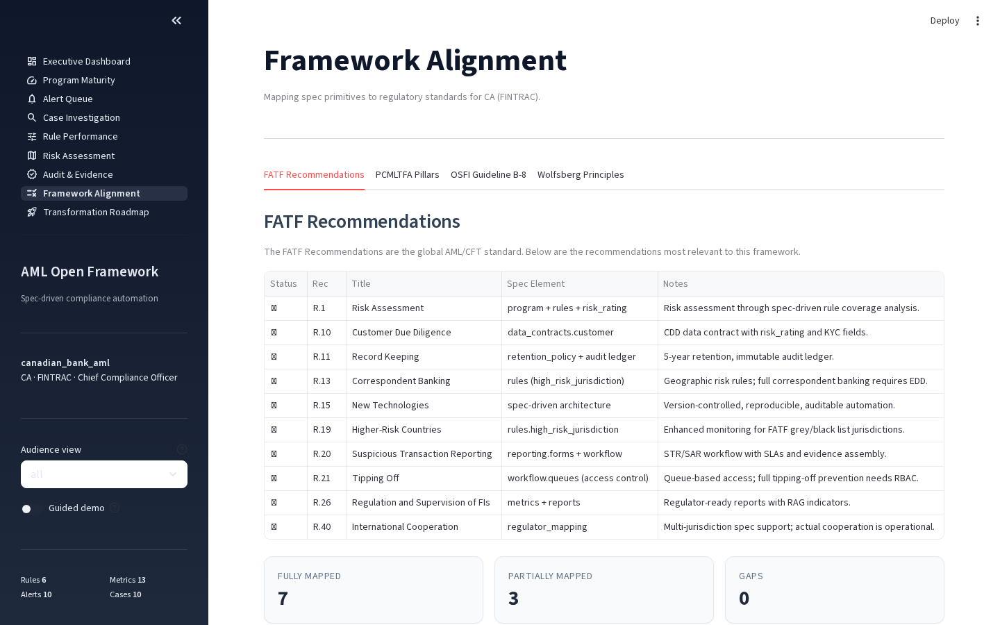

# Multi-Jurisdiction Support

The framework supports **geo-based default policies** — the same architecture adapts to different regulatory regimes based on the `jurisdiction` field in `aml.yaml`. The dashboard Framework Alignment tab switches CA/EU specially; other jurisdictions fall back to FinCEN BSA-style tabs. Regulator export formats are per-jurisdiction: goAML (FATF/FINTRAC), CA-FINTRAC audit pack, and AMLA RTS draft (EU — non-submittable pending final RTS). See the individual export commands in the [API/CLI reference](api-reference.md).

## Bundled Example Specs

| Spec | Jurisdiction | Regulator | Filing Types |
|---|---|---|---|
| `examples/community_bank/aml.yaml` | US | FinCEN | SAR, CTR |
| `examples/community_bank_lookback/aml.yaml` | US | FinCEN | SAR, CTR (look-back / re-run variant) |
| `examples/canadian_bank/aml.yaml` | CA | FINTRAC | STR, LCTR, EFTR |
| `examples/canadian_schedule_i_bank/aml.yaml` | CA | FINTRAC + OSFI | STR, LCTR (TD case-study patterns) |
| `examples/eu_bank/aml.yaml` | EU | EBA | EU STR (AMLD6) |
| `examples/uk_bank/aml.yaml` | UK | FCA | UK SAR (POCA 2002) |
| `examples/cyber_enabled_fraud/aml.yaml` | US | FinCEN/FATF | SAR + investment-scam typology |
| `examples/crypto_vasp/aml.yaml` | Cross-border | FATF R.16 / FinCEN / FINTRAC | VASP STR/SAR (network_pattern + Travel Rule) |
| `examples/trade_based_ml/aml.yaml` | US | FinCEN + FATF/Egmont | SAR with TBML typology indicators (Round-7) |
| `examples/uk_app_fraud/aml.yaml` | UK | FCA + PSR + NCA | UK SAR + PSR reimbursement decision (Round-7) |
| `examples/us_rtp_fednow/aml.yaml` | US | FinCEN / RTP / FedNow | RTP/FedNow push-fraud detector pack (Round-8) |
| `examples/austrac_tranche_2_dnfbp/aml.yaml` | AU | AUSTRAC | SMR + TTR (Tranche 2 DNFBPs — #500) |
| `examples/genius_ppsi_issuer/aml.yaml` | US | FinCEN (GENIUS Act) | SAR (PPSI stablecoin issuer — #500) |
| `examples/genius_ppsi_stablecoin/aml.yaml` | US | FinCEN + OFAC (GENIUS Act PPSI NPRM) | SAR + proposed PPSI CTR (richer NPRM-grounded stablecoin spec — #513) |

All fourteen execute the same engine; the jurisdictional differences live in:
- the `regulation_refs` citations on each rule
- the workflow queue names + filing forms
- the dashboard's Framework Alignment tab content
- the export format (goAML for FATF/FINTRAC/generic, AMLA RTS draft for EU)

---

## United States — FinCEN / BSA

The US specs (`community_bank`, `cyber_enabled_fraud`) align with:

- **31 CFR 1010** — Bank Secrecy Act recordkeeping and reporting requirements
- **FinCEN's 2024 effectiveness rule + 2026 supervisory guidance** — measures program effectiveness in terms of *investigations*, not raw alert counts (drives the [investigation aggregator](../src/aml_framework/cases/aggregator.py))
- **FinCEN BSA 6 Pillars** including the April 2026 proposed 6th pillar (formalized risk assessment)
- **OFAC SDN list** screening via the `list_match` rule type
- **FinCEN advisories** (FIN-2014-A005 cash-to-wire, FIN-2023-Alert005 pig-butchering, FIN-2006-A003 unusual volume)

Filing forms: **SAR** (Suspicious Activity Report) and **CTR** (Currency Transaction Report) for cash >$10,000.

```bash
aml dashboard examples/community_bank/aml.yaml
```

---

## Canada — FINTRAC + OSFI

The Canadian specs (`canadian_bank`, `canadian_schedule_i_bank`) align with:

- **PCMLTFA** (Proceeds of Crime Money Laundering and Terrorist Financing Act) and **PCMLTFR** — every rule citation references a specific section (e.g., `PCMLTFA s.11.1` for structuring, `PCMLTFR s.7(1)` for LCTR obligations)
- **FINTRAC reporting forms** — STR (Suspicious Transaction Report), LCTR (Large Cash Transaction Report >CAD 10,000), EFTR (Electronic Funds Transfer Report >CAD 10,000)
- **OSFI Guideline B-8** — enhanced expectations for federally regulated institutions: board oversight, automated monitoring, sanctions integration
- **PCMLTFR s.132** — 24-hour aggregation rule for cash transactions
- **5-year retention** for all records (PCMLTFR s.144-145)

The dashboard's **Framework Alignment** page automatically shows **PCMLTFA Pillars** and **OSFI Guideline B-8** tabs instead of FinCEN BSA Pillars when running with a Canadian spec:



```bash
aml dashboard examples/canadian_bank/aml.yaml
aml dashboard examples/canadian_schedule_i_bank/aml.yaml  # TD case-study patterns
```

The `canadian_schedule_i_bank` spec encodes the patterns FINTRAC cited in its 2024 enforcement actions against TD (CAD 9.2M penalty) — repeated PEP transactions, structuring at the LCTR threshold, dormant-account reactivation. Useful as a reality-check for Big-six Canadian programs.

---

## European Union — EBA / AMLD6

The EU spec (`eu_bank`) aligns with:

- **AMLD6 (Directive 2018/1673)** — criminal liability for money laundering, expanded predicate offenses
- **EBA AML/CFT Guidelines** — risk-based approach, EDD triggers, customer due diligence
- **EU Regulation 2023/1113** (Transfer of Funds) — EU implementation of FATF R.16 Travel Rule
- **AMLA** (Anti-Money Laundering Authority, operational July 2026) — direct supervision of high-risk cross-border institutions
- **AMLA RTS draft (July 2026)** — STR submission format

Spec includes:
- 7 detection rules covering structuring, high-risk-jurisdiction, PEP screening, rapid-movement, sanctions, FATF R.16 travel-rule completeness, and INVS pig-butchering
- ISO 20022 `purpose_code` column on the `txn` data contract for the typology library snippets
- 5-year retention per GDPR + AMLD6 art. 40

```bash
aml dashboard examples/eu_bank/aml.yaml
```

The framework ships a goAML 5.0.2 exporter (`aml export-goaml`) and an AMLA RTS JSON draft exporter (`aml export-amla-str`) — see [`api-reference.md`](api-reference.md) for invocation details.

---

## United Kingdom — FCA / POCA

The UK spec (`uk_bank`) aligns with:

- **POCA 2002** (Proceeds of Crime Act) — the predicate offense framework
- **MLR 2017** (Money Laundering, Terrorist Financing and Transfer of Funds Regulations) — implementing FATF R.16 in UK law
- **FCA Handbook** — SYSC, FCG, and FG24/4 (APP-fraud detection expectations)
- **OFSI sanctions** — UK consolidated list screening via `list_match`
- **UK Payment Systems Regulator (PSR) APP-fraud reimbursement** (effective Oct 2024, full effect Apr 2026) — drives the [pacs.004 return-reason mining library](../src/aml_framework/spec/library/iso20022_return_reasons.yaml)
- **FCA Mar 2026 Dear CEO letter on SAR backlogs** — drives the [SLA timer + escalation engine](../src/aml_framework/cases/sla.py)

Filing form: **UK SAR** to the National Crime Agency (NCA) under POCA s.330-332.

```bash
aml dashboard examples/uk_bank/aml.yaml
```

### Fraud ↔ AML cross-program case linkage (`uk_app_fraud`)

`examples/uk_app_fraud/aml.yaml` is the bundled demonstrator of
**cross-program case linkage** — the [`cases/linkage.py`](../src/aml_framework/cases/linkage.py)
mechanism that surfaces a subject under parallel investigation by both
the fraud team and the financial-crime (AML) team. The spec carries two
alert streams over the same accounts:

- **Fraud-domain** — the four APP-fraud rules (`first_use_payee_large_amount`,
  `cop_mismatch_override`, `vulnerable_customer_atypical_payment`,
  `rapid_pass_through_mule`), each tagged `aml_priority: fraud`.
- **AML-domain** — `layering_dispersal_to_multiple_payees`
  (`aml_priority: other`), the AML team's POCA s.327 layering detector
  for rapid dispersal of received funds across multiple payees.

The planted mule **C0019** trips both the fraud-domain
`rapid_pass_through_mule` and the AML-domain layering rule, so
`aml run examples/uk_app_fraud/aml.yaml --seed 42` writes a
**`case_links.jsonl`** artifact (manifest-pinned, frozen post-finalize)
with one cross-program link, and the dashboard's
[Case Investigation page](dashboard-tour.md) shows a *Linked across
domains* row. Export the full linked-case evidence bundle with
`aml export` (the run-dir ZIP includes `case_links.jsonl`).

---

## Australia — AUSTRAC / AML-CTF Act

The Australian spec (`austrac_tranche_2_dnfbp`) models a **Tranche 2 reporting entity** — a designated non-financial business or profession (DNFBP: lawyers, accountants, real-estate agents, dealers in precious metals/stones) brought into the regime by the 2024 AML/CTF amendments. It aligns with:

- **AML/CTF Act 2006** — every AML/CTF rule citation references a specific section: `s.43` (threshold transaction reports), `s.41` (suspicious matter reports), `s.36` (ongoing customer due diligence); sanctions screening cites the **Autonomous Sanctions Act 2011 (Cth)** / DFAT Consolidated List, not the AML/CTF Act program section
- **AUSTRAC reporting forms** — TTR (Threshold Transaction Report, cash AUD $10,000+) and SMR (Suspicious Matter Report)
- **AUSTRAC DNFBP Guidance 2024** — sector-specific onboarding and ongoing-monitoring expectations for Tranche 2 entities
- **FATF Recommendation 22** — DNFBP customer due diligence

Key rules: cash structuring below the AUD $10,000 TTR threshold, rapid pass-through (cash-in then wire-out within 48h), outbound wires to FATF call-for-action jurisdictions (KP/IR/MM), dormant-client reactivation with sudden large activity, DFAT Consolidated List sanctions screening, and adverse-media screening. The workflow routes investigator → SMR filing → closed.

```bash
aml dashboard examples/austrac_tranche_2_dnfbp/aml.yaml
```

---

## United States — FinCEN / PPSI (GENIUS Act)

The stablecoin-issuer spec (`genius_ppsi_issuer`) models a **permitted payment stablecoin issuer (PPSI)** under the **GENIUS Act** federal stablecoin framework. It aligns with:

- **GENIUS Act s.4** — BSA/AML program obligations for permitted payment stablecoin issuers
- **31 CFR 1022** — money-services-business AML program and reporting requirements (`1022.210` program, `1022.320` SAR / suspicious-structuring), used here as an *interim MSB-baseline* framing. Note: the later **GENIUS Act PPSI NPRM** (see the richer spec below) EXCLUDES PPSIs from the MSB definition and proposes a *PPSI-specific* regime (31 CFR Part 502 OFAC + proposed 31 CFR 1033 reporting); the richer `genius_ppsi_stablecoin` spec therefore cites that PPSI-specific authority instead of the 1022 MSB rules.
- **FinCEN FIN-2019-G001** — convertible virtual currency guidance (nested-VASP / pass-through typologies)
- **OFAC SDN — virtual currency addenda** — sanctioned-wallet screening
- **FATF Recommendation 16** — Travel Rule completeness on outbound transfers

Filing form: **SAR**. Key rules cover the stablecoin-specific typologies: rapid mint-then-redeem within 24h, outbound transfers to FATF call-for-action jurisdictions (KP/IR/MM), suspicious structuring below the USD $10,000 reporting threshold, OFAC SDN wallet screening, nested-VASP same-day pass-through churn, and adverse-media screening.

```bash
aml dashboard examples/genius_ppsi_issuer/aml.yaml
```

### GENIUS Act PPSI / stablecoin issuer (richer NPRM-grounded spec)

`examples/genius_ppsi_stablecoin/aml.yaml` is the **richer companion** to the basic issuer spec above, grounded in the joint **FinCEN/OFAC NPRM** "Permitted Payment Stablecoin Issuer AML/CFT Program and Sanctions Compliance" (**Federal Register 2026-06963**, published 2026-04-10; comment deadline 9 June 2026). What it adds over `genius_ppsi_issuer`:

- **New 31 CFR Part 502 OFAC sanctions program** — the NPRM stands up a dedicated PPSI sanctions regime; the `ofac_sdn_screening` rule cites Part 502 explicitly (freeze-and-report on an SDN match, including the virtual-currency-address addenda).
- **ISO 20022 pacs.008 fields** on the `txn` contract (`debtor_bic`, `creditor_bic`, `uetr`, `purpose_code`) the iso20022 ingestion adapter populates on wire/RTP rails — declared nullable so synthetic/CSV rows still load.
- **`program.sla` block** — FinCEN SAR/CTR filing-latency SLA (`alert_disposition_days: 30`); the engine records breaches in `sla_report.json`.
- **PPSI-specific citations** — the NPRM EXCLUDES PPSIs from the MSB definition, so the SAR/program rules cite `GENIUS Act s.4` / the NPRM (`FR 2026-06963`) rather than the 31 CFR 1022 MSB rules.
- **Proposed PPSI currency-transaction report** — the NPRM PROPOSES a PPSI-specific currency-transaction report (proposed `31 CFR 1033.310`-315, cross-referencing the $10,000 aggregate-day threshold of `31 CFR 1010.311`), modelled as the `FINCEN_CTR` form alongside `FINCEN_SAR`. This is a *proposed* obligation (comment deadline 9 June 2026), distinct from the generic cash CTR.

Six rules: stablecoin mixing/layering (fan-in + fan-out churn in a recent 7-day window), rapid on-ramp/off-ramp cycling (mint + redeem in a recent 7-day window), structuring below the USD $10,000 reporting threshold, VASP counterparty exposure to FATF call-for-action jurisdictions (KP/IR/MM), OFAC SDN screening (31 CFR Part 502), and adverse-media screening. The workflow routes investigator → SAR filing → closed.

```bash
aml dashboard examples/genius_ppsi_stablecoin/aml.yaml
```

---

## Cross-Border / Specialty Specs

### `examples/cyber_enabled_fraud/aml.yaml`

US-jurisdictional spec focused on the **FATF Cyber-Enabled Fraud (Feb 2026)** typology paper: pig-butchering / investment scams, romance scams, business email compromise, and APP-fraud convergence. Composes with the [pacs.004 return-reason library](../src/aml_framework/spec/library/iso20022_return_reasons.yaml) for UK PSR reimbursement-mandate analytics.

### `examples/crypto_vasp/aml.yaml`

Virtual Asset Service Provider spec aligned with **FATF R.15-16** for crypto, **FinCEN's FIN-2019-G001** virtual currency guidance, and **FINTRAC's PCMLTFR s.7.7** (dealers in virtual currency). Built around TRM Labs' 2026 Crypto Crime Report finding that stablecoins accounted for ~84% of fraud-scheme inflows in 2025 with hold times collapsing under 48 hours.

Demonstrates two framework features that don't appear in the fiat-bank specs:
- **`network_pattern` rule type** (PR #16) — detects layering through multi-hop wallet graphs
- **Wallet-screening `list_match`** against `data/lists/sanctioned_wallets.csv` (OFAC SDN crypto addresses)
- **Counterparty attribution via `vasp/`** module (PR #55) — public-data Chainalysis alternative that maps wallet clusters to known VASPs

```bash
aml dashboard examples/crypto_vasp/aml.yaml
```

---

## Adapting a Spec to Your Institution

The bundled specs are reference designs, not turnkey deployments. To adapt:

1. **Copy the closest jurisdictional match** to a new directory under `examples/` or your own repo
2. **Replace the program metadata**: `program.name`, `program.regulator`, `program.owner`, `program.effective_date`
3. **Adjust thresholds** — the bundled rules use indicative thresholds (e.g., USD 9,500 for structuring); your institution's risk appetite + customer base should drive the actual values
4. **Add institution-specific rules** — every rule needs a `regulation_refs` citation; use the [Typology Catalogue](dashboard-tour.md#typology-catalogue) page or the [`spec/library/`](../src/aml_framework/spec/library/) snippets for starting points
5. **Wire your data contract** — add columns to the `txn` / `customer` data contracts that match your warehouse schema; the engine validates schema compatibility at load time

See [`spec-reference.md`](spec-reference.md) for the field-by-field guide and [`audit-evidence.md`](audit-evidence.md) for the evidence-bundle contract every adapted spec inherits.
